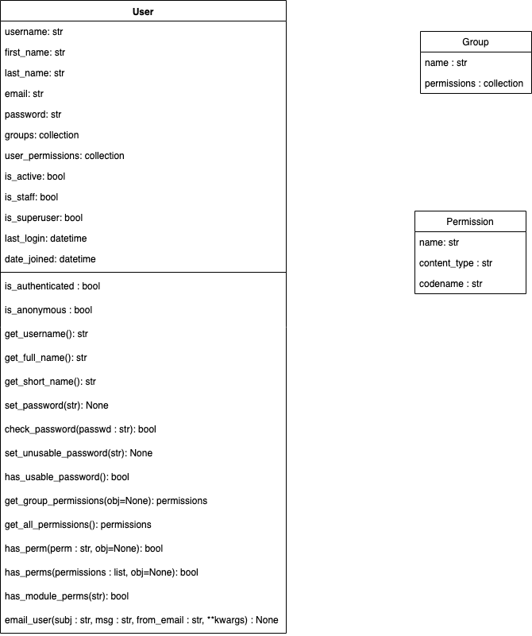

project name : authenticate
application name : user_example

settings.py contents : 
   loaded decouple
   SECRET_KEY is hidden
   INSTALLED_APPS in user_example.apps.UserExampleConfig (app in uzun şekilde yazılmış hali bu, sadece user_example da yeterli oluyor son versiyonlarında.)
   LOGIN_REDIRECT_URL = '/'  en alt satırda da bu kod var.Login olmuş bir kullanıcıyı nereye göndermek istediğimizi belirtiyoruz bu yolla.

settings.py contents : 
   include ile eklenen url ler iki tane. 
       path('', include("user_example.urls")),
       path('accounts/', include('django.contrib.auth.urls'))


app imizin içindeki ->

urls.py ->
    path('special/', special, name='special'),
    path('register/', register, name='register'),
    path('password_change/', auth_views.PasswordChangeView.as_view(template_name="registration/password_change.html"), name="password_change")


views.py ->
    ders  sırasında incelenecek.


### start
- Create virtual environment as a best practice:

```py
python -m venv env # for Windows
py -m venv env # for Windows
```
- Activate scripts:
```bash
.\env\Scripts\activate  # for Windows
```

- requirements.txt içeriğini yükleme:
```bash
pip install -r requirements.txt # requirements.txt içeriğini yükleme
py -m pip install --upgrade pip # upgrade to pip
```

settings.py da SECRET_KEY imiz olmadığı için proje çalışmaz. proje klasörünün seviyesinde .env file oluşturup, içerisine bir secret_key yazıyoruz. google dan secret key generator django diyoruz, https://djecrety.ir/ dan secter key generate edip .env içerisine SECRET_KEY=!!!l%42ic@nrya1j#g_7e%y$(b$yb78x^dey^a(omoqk!6g-&z  şeklinde tırnaksız olarak kaydediyoruz.

- go to terminal
```bash
py manage.py runserver
```

```bash
py manage.py migrate
```

```bash
py manage.py runserver
```

### Core

şimdiye kadar environment oluşturup active ettik, requirements.txt içeriğini kurduk, secret key oluşturduk ve .env içerisine kaydettik.

Hangi kullanıcının, hangi seviyede bizim web sitemizde etkileşime gireceğini biz bu sistem sayesinde belirliyoruz.

The primary attributes of the default user are:
default user object in temel attributes leri 

- username
- password
- email
- first_name
- last_name

### Django Authentication System

Django içerisinde Authentication ile ilgili olan iki kısım var, INSTALLED_APPS ve MIDDLEWARE

```py
INSTALLED_APPS = [
    'django.contrib.admin',
    'django.contrib.auth', # Burası
    'django.contrib.contenttypes',  # Burası
    'django.contrib.sessions',
    'django.contrib.messages',
    'django.contrib.staticfiles',
    'user_example.apps.UserExampleConfig',
]
```

```py
MIDDLEWARE = [
    'django.middleware.security.SecurityMiddleware',
    'django.contrib.sessions.middleware.SessionMiddleware', # Burası kullanıcının aynı session da kalması, sayfayı kapatsa bile tekrar sayd-fayı açtığında yine login olduğu haliyle sayfaya girebilmesi
    'django.middleware.common.CommonMiddleware',
    'django.middleware.csrf.CsrfViewMiddleware',
    'django.contrib.auth.middleware.AuthenticationMiddleware', # Burası kullanıcıların requestlerini takip eden
    'django.contrib.messages.middleware.MessageMiddleware',
    'django.middleware.clickjacking.XFrameOptionsMiddleware',
]
```


# Login Admin Site

Önce superuser oluşturuyoruz.

```py
python manage.py createsuperuser  # or with the parameters
python manage.py createsuperuser --username admin --email admin@mail.com
```


```py
py manage.py runserver
```


go to admin page

Yeni bir grup oluşturacağız. Groups un yanındaki +add e tıklayıp grup ismi verip yetkilendirmesini yapabiliyoruz. Clarusway diye bir grup oluşturduk. auth | group |Can add group permission yetkilendirmesini yaptık.

Şimdi bir de user oluşturuyoruz. Halihazırda admin olarak girdiğimiz bir user var. User oluşturduk.


### The Django Authentication Models

Django.contrib.auth.models has 
- User, 
- Permission,
- Group Models,

Below you can see the class diagrams for User as well as Permission and Group.




# Add users programmatically

Programatik olarak kullanıcı oluşturma. Programatik demek clı (commend line interface) kullanmak demek. clı kullanarak çeşitli komutlarla bu işlemleri yapmak demek. Bu birçok açıdan çok daha hızlı işlem yapmanızı sağlıyor.

go to terminal

serverı durduruyoruz.


- powershell deki dosya yolumuz nasıl kısaltılır?

google: shorten powershell prompt
https://stackoverflow.com/questions/42862604/powershell-shortened-the-directory-prompt-but-how-to-save-the-change

```bash
function prompt {'Code: '}
```
artık terminalde sadece Code: yazacak


Başlamadan önce dokümantasyona gidelim, bakalım ne diyor?

https://docs.djangoproject.com/en/3.2/topics/auth/default/


- Creating users

create user için  create_user() helper function u var, bu fonksiyon sayesinde user oluşturmak mümkün. django.contrib.auth.models in User object ini import ediyor, ve aşağıda fonksiyonu kullanıyor

```py

>>> from django.contrib.auth.models import User
>>> user = User.objects.create_user('john', 'lennon@thebeatles.com', 'johnpassword')

# At this point, user is a User object that has already been saved
# to the database. You can continue to change its attributes
# if you want to change other fields.
>>> user.last_name = 'Lennon'
>>> user.save()

```

Önce shell imizi açıyoruz, komut neydi?: ->
go to terminal
```bash
python manage.py shell
or
py manage.py shell
```

shell imiz geldi, shell imize yazıyoruz artık ->
```py
from django.contrib.auth.models import User
```
import ettik, sonra ilk kullanıcımızı oluşturacağız. Bir kullanıcıya eşitleyeceğiz, user eşittir ile başlıyoruz ve buna yeni bir kullanıcı oluşturuyoruz. Şimdi bu kullanıcı oluşturuyor ve database e doğrudan kaydediyor, yani bu komuttan create_user() fonksiyonundan sonra .save() kullanmaya gerek yok. Bunun dışında üç tane parametre istiyor create_user(username, email=None, password=None, **extra_fields) extra field ları sona bırakacağız.


```py
python manage.py shell

from django.contrib.auth.models import User

# Create user and save to the database
# create_user(username, email=None, password=None, **extra_fields)
# Creates, saves and returns a User.
user = User.objects.create_user('myusername', 'myemail@crazymail.com', 'mypassword')
# The username and password are set as given. 
# The domain portion of email is automatically converted to lowercase, and the returned User object will have is_active set to True.
# If no password is provided, set_unusable_password() will be called.
# The extra_fields keyword arguments are passed through to the User’s __init__ method to allow setting arbitrary fields on a custom user model.
# Extra fields:
User.objects.create_user('john', email='lennon@thebeatles.com', password='johnpassword', is_staff=True)
# Or
user.is_staff=True 
user.save()

# Update fields and then save again
user.first_name = 'John'
user.last_name = 'Citizen'
user.save()
```

yeni kullanıcı oluşturuyoruz; ->
```py
user = User.objects.create_user('backteam', 'myemail@crazymail.com', 'mypassword')
```
çalıştırdık,

Şimdi başka bir terminal açıp runserver yapıp admin page imize gidip oluşturduğumuz user ı görüyoruz.

user a first name , last name tanımlamamıştık, şimdi onları tanımlayacağız.
```py
user.first_name = 'John'
```
admin page de bir değişiklik olmadı, bunun sebebi bu şekilde additional olan parametreleri belirledikten sonra user.save() demek zorundayız. 
```py
user.save()
```
şimdi bakıyoruz admin page e eveet first name John olarak kaydetmiş.

user a last name ve stuff tanımlayacağız.
```py
user.last_name = 'Citizen'
user.save()
```

```py
user.is_staff = True
user.save()
```

- Bir user ın first_name, last_name ini değiştirme: ->

önce user ı bir değişkene atıyoruz,
```py
>>> user1 = User.objects.get(username='john') 
>>> user1
```

dönüşü:
```py
<User: john>
```

arkasından:
```py
>>> user1.first_name = 'John' 
>>> user1.save()
```


- Changing passwords - Password değiştirme

```py
>>> from django.contrib.auth.models import User
>>> u = User.objects.get(username='john')
>>> u.set_password('new password')
>>> u.save()
```

Bizim oluşturduğumuz user ın password ünü değiştiriyoruz. ->
```py
>>> user = User.objects.get(username='john')
>>> user.set_password('new password')
>>> user.save()
```

kullanıcının password ünü değiştirdik, username ini de değiştirelim: 
backteam olan username i John olarak değiştirdik, sonra tekrar değiştirdik. ->
```py
>>> user = User.objects.get(username='backteam')
>>> user.username = 'John'
>>> user.save()
```


- Deleting user - user silme, programatik olarak.

1. yöntem
```bsh
User.objects.get(username='umit').delete()
```


2. yöntem (Aktif statüsünü False yapmak)
Nasıl yapıyoruz? kütüphanemizi zaten çağırdık, 
```bash
User.objects.get(first_name='John')
```

enter a bastık bize; ->
```bash
<User: backteam>
```
verdi, tamam yakalamışız böylece istediğimiz user ın Active statüsünü False yapabiliriz nasıl? ; -> 


```bash
user2=User.objects.get(first_name='John')
user2.is_active=false
user2.save()
```

sonra bu kullanıcı ile login olmaya çalışınca login olamıyor, admin page e gittiğimizde bu kullanıcının Permissions da Active statüsünün kalkmış olduğunu gördük. Bunu yaptığımızda kullanıcı login olamıyor ama ayarları hala duruyor belki ileride tekrar active etmeniz gerekirse, bazı ufak ayarlar ile user ı tekrar active edebiliriz.


# Add users with auth

Djangoda admin pagede ve programatic olarak kullanıcı eklemeyi gördük, ama bunu yazdığımız views lar sayesinde kullanıcının login olmasını kendi hesabını oluşturmasını sağlayacağız ki bu en temel web sitesi ayarlarından bir tanesidir.

We want to allow adding regular users to our app.

path('accounts/', include('django.contrib.auth.urls'))

django.contrib.auth paketi var, bu paket default olarak login, logout, passwordchange gibi view ları içeriyor. Bunun url lerini çağırdığımızda accounts/ başında olacak.

Biz local hosttan :8000/accounts/ a gittiğimizde bize birçok yol veriyor, bunları django.contrib.auth kütüphanesinin kendi default url leri. mesela öncelikle login e bakalım. 8000/accounts/login/  bize bir default olarak bir login page veriyor, bu view ü biz yazmadık. Değişik değişik default olarak tanımlanmış sayfalar var.

- Go to authenticate/urls.py and add:
```py
from django.contrib import admin
from django.urls import path, include

urlpatterns = [
    path('admin/', admin.site.urls),
    ### And using some urls which Django give us about authentication:
    path('accounts/', include('django.contrib.auth.urls'))
]
```

Bizim oluşturmadığımız bir view var o da accounts, nereden çağırıyoruz? default olarak django.contrib.auth kütüphanesinden çağırıyoruz.

home page e gidip oradan url' ye /accounts/login/ tıkladıktan sonra user1 ve password ü ile login olduk,

home Template ine gidip değişiklik yaptık.

user1 olarak login olunca artık admin page e giremiyoruz.
<home.html> ->
```py
<h1>This is the home page!</h1>

{{ user.username }}
<br>
{{ user.first_name }}
```

Bu değişikliği yaptık ama first_name i olmayan userlar için bize hata verir, bu hatayı almamak için; if condition ile eğer user.first.name true ise {{user.first_name}} ver false ise yani yok ise else birşey verme! ile çözüyoruz.
<home.html> ->

```py
<h1>This is the home page!</h1>

{{ user.username }}
<br>


    {{ user.first_name }}

    
```


/*************************************************************/
/*************************************************************/


- Creating superusers
devamında createsuperuser command inden bahsediyor,

```bash
$ python manage.py createsuperuser --username=joe --email=joe@example.com
```


/*************************************************************/
/*************************************************************/


login den sonra logout a bakalım; logout olduktan sonra tekrar login olmak istediğimizde bizi default olarak admin giriş sayfasına yönlendiriyor, bu düzeltilecek.

settings.py da en alta yazdığımız <LOGIN_REDIRECT_URL = '/'> bizim login olunca nereye gideceğimize işaret ediyor. Burada home page e yönlendirilmiş. Biz onu değiştirdiğimizde login olunca değiştirdiğimiz page e gidecektir.