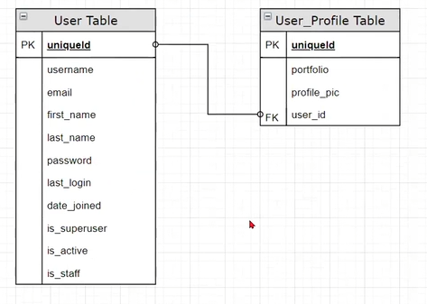

En baştan ->

- 1. Kısım ->

# BASE USER PRECLASS SETUP

```bash
# CREATING VIRTUAL ENVIRONMENT
# windows
py -m venv env
# windows other option
python -m venv env
# linux / Mac OS
vitualenv env

# ACTIVATING ENVIRONMENT
# windows
.\env\Scripts\activate
# linux / Mac OS
source env/bin/activate

# PACKAGE INSTALLATION
# if pip does not work try pip3 in linux/Mac OS
pip install django
py -m pip install --upgrade pip # upgrade to pip
# alternatively python -m pip install django
pip install python-decouple
pip install pillow
pip install django-crispy-forms
pip freeze > requirements.txt


django-admin --version
django-admin startproject main .
```

- requirements.txt içeriğini yükleme:
```bash
pip install -r requirements.txt # requirements.txt içeriğini yükleme
py -m pip install --upgrade pip # upgrade to pip
```

go to terminal
terminale git

```bash
py manage.py runserver
```

click the link with CTRL key pressed in the terminal and see django rocket.
terminaldeki linke tıkla ve tarayıcıdaki roketi gör.

go to terminal, stop project, add app
terminale git ve projeyi durdur, app ekle

```bash
py manage.py startapp users
```

go to settings.py and add 'users' app and 'crispy_forms' to installed apps and add import os and below lines
settings.py a git, 'users' app ini ve 'crispy_forms' unu installed apps e ekle ve os u import et, aşağıdaki satırları en alt kısma ekle

<settings.py> ->

```python
import os

INSTALLED_APPS = [
    'django.contrib.admin',
    'django.contrib.auth',
    'django.contrib.contenttypes',
    'django.contrib.sessions',
    'django.contrib.messages',
    'django.contrib.staticfiles',
    # 3rd party apps,
    'crispy_forms',
    # my apps
    'users',
]

MEDIA_ROOT = os.path.join(BASE_DIR, 'media')
MEDIA_URL = '/media/'

CRISPY_TEMPLATE_PACK = 'bootstrap4'
```

- create these folders at project level as /media/profile_pics.
proje klasörü düzeyinde /media/profile_pics klasörlerini oluşturun.

- create template folder as users/templates/users
users/templates/users olarak template klasörü oluştur

- users/static/users klasörü oluşturup, içerisine css, images, js klasörlerini oluştur.
  css klasörü içeriğinde <style.css> ve <bootstrap.min.css> (anlamadım?) olmak üzere iki tane css dosyası var, bunun <style.css> (sadece h1 tag ına background-color red verilmiş. sadece home page de h1 tag ı var.) dosyası link verilerek kullanılmış, diğeri yoruma alınmış.
  images klasörü içerisine  cw_logo.jpg dosyası konulmuş.
  js klasörü içerisinde <timeout.js> dosyası var. Bunun içindeki kodlar message ların ekranda kalış süresini ayarlıyor.
  (Dosya içerikleri öncen oluşturulmuştur.)
  <booststrap.min.css> <style.css> <timeout.js>  (copy-past dir.)

- users/templates/users içerisine base.html dosyası oluştur. İçeriğine ->

- static leri belirtiyoruz.

- bootstrap için versiyon uyumsuzluğu olmasın diye <base.html> de, aşağıdaki sayfadaki versiyon (v4.0.0) 
  kodlarıyla link veriyoruz.

- <bootstrap.min.css> e link veriyoruz ve yoruma alıyoruz, <style.css> e link veriyoruz burada onu 
  kullanıyoruz.

- önceden oluşrulmuş bir <navbar.html> template i var ve onu include ederek navbar olarak kullanıyoruz.

- Bir div açıyoruz; içerisine message ları gönderip onlara stil veriyoruz.
- Açtığımız div in en sonuna block - endblock elementimizi koyuyoruz

- bootstrap script leri için versiyon uyumsuzluğu olmasın diye aşağıdaki sayfadaki versiyon (v4.0.0) 
  kodlarını kullanıyoruz.

- js scriptlerinin yerini gösteriyoruz, body nin kapanış tag ının hemen üstünde.

<base.html> ->

```html

<!DOCTYPE html>


<html lang="en">
<head>
    <meta charset="UTF-8">
    <meta http-equiv="X-UA-Compatible" content="IE=edge">
    <meta name="viewport" content="width=device-width, initial-scale=1.0">

    <link
      rel="stylesheet"
      href="https://maxcdn.bootstrapcdn.com/bootstrap/4.0.0-alpha.6/css/bootstrap.min.css"
      integrity="sha384-rwoIResjU2yc3z8GV/NPeZWAv56rSmLldC3R/AZzGRnGxQQKnKkoFVhFQhNUwEyJ"
      crossorigin="anonymous"
    />

    
    <link rel="stylesheet" href="">
    
    
    <link rel="stylesheet" href="">

    <title>Document</title>
</head>

<body>
    

    <div style="margin-top: 100px; margin-bottom: 100px" class="container">
        
        
        
        <div class="alert alert-danger">{{ message }}</div>
        
        <div class="alert alert-{{ message.tags }}">{{ message }}</div>
        
        
        
         
    </div>

    <script src="https://code.jquery.com/jquery-3.2.1.slim.min.js"
        integrity="sha384-KJ3o2DKtIkvYIK3UENzmM7KCkRr/rE9/Qpg6aAZGJwFDMVNA/GpGFF93hXpG5KkN"
        crossorigin="anonymous">
    </script>
    <script src="https://cdnjs.cloudflare.com/ajax/libs/popper.js/1.12.9/umd/popper.min.js"
        integrity="sha384-ApNbgh9B+Y1QKtv3Rn7W3mgPxhU9K/ScQsAP7hUibX39j7fakFPskvXusvfa0b4Q"
        crossorigin="anonymous">
    </script>
    <script src="https://maxcdn.bootstrapcdn.com/bootstrap/4.0.0/js/bootstrap.min.js"
        integrity="sha384-JZR6Spejh4U02d8jOt6vLEHfe/JQGiRRSQQxSfFWpi1MquVdAyjUar5+76PVCmYl"
        crossorigin="anonymous">
    </script>
    <script src=""></script>
</body>
</html>

```

users/templates/users içerisine home.html dosyası oluştur.

<home.html> ->

```html



<h1>Home Page</h1>

<h2>Wellcome {{request.user}}!</h2>

<h2>Wellcome Guest!</h2>



```

users/templates/users içerisine register.html dosyası oluştur. crispy form kullan.

<register.html> ->

```html




<h2>Registration Form</h2>

<h3>Thanks for registering</h3>

<h3>Fill out the form please!</h3>
<form action="" method="post" enctype="multipart/form-data">
    {{ form_user | crispy }} {{ form_profile | crispy }}
    <button type="submit" class='btn btn-danger'>Register</button>
</form>



```

users/templates/users içerisine user_login.html dosyası oluştur. crispy form kullan.

<user_login.html> ->

```html




<div class="row">
    <div class="col-md-6 offset-md-3">
        <h3>Please Login</h3>

        <form action="" method="post">
             {{ form | crispy }}
            <button type="submit" class="btn btn-danger">Login</button>
        </form>
    </div>
</div>


```

users/templates/users içerisine navbar.html dosyası oluştur. static lere dikkat.

<navbar.html> ->

```html



<nav class="navbar navbar-toggleable-md navbar-inverse fixed-top bg-inverse">
    <button class="navbar-toggler navbar-toggler-right"
    type="button"
    data-toggle="collapse"
    data-target="#navbarCollapse"
    aria-controls="navbarCollapse"
    aria-expanded="false"
    aria-label="Toggle navigation">
    <span class="navbar-toggler-icon"></span>
    </button>
    <a class="navbar-brand" href="">
        
    Clarusway FS</a>

    <div class="collapse navbar-collapse" id="navbarCollapse">
        <ul class="navbar-nav mr-auto">
            <li class="nav-item active">
                  
                <a class="nav-link" href="">Students</a>
            </li>
            
            <li class="nav-item active">
                <a class="nav-link" href="">Contact</a>
            </li>
        </ul>

        <ul class="navbar-nav ml-auto">
             

            <li class="nav-item active"> 
                <a class="nav-link" href="/admin">Admin</a>
            </li>

            

            <li class="nav-item active">   
                  
                <a class="nav-link" href="">Log Out</a>
            </li>

            

            <li class="nav-item active">
                  
                <a class="nav-link" href="">Log In</a>
            </li>

            

            <li class="nav-item active">
                  
                <a class="nav-link" href="">Register</a>
            </li>
        </ul>
    </div>
</nav>

```

create folder under users/static/users/images
users/static/users/images hiyerarşisinde klasör oluştur

copy cw_logo.jpg file to this folder
cw_logo.jpg dosyasını bu klasöre kopyala

go to users.views.py
users.views.py dosyasına git

<users.views.py> ->

```py

from django.shortcuts import render

# Create your views here.

def home(request):
    return render(request, 'users/home.html')

```

go to main.urls.py
main.urls.py dosyasına git

<main.urls.py> ->

```py

from django.contrib import admin
from django.urls import path, include
from users.views import home
from django.conf.urls.static import static
from django.conf import settings

urlpatterns = [
    path('admin/', admin.site.urls),
    path('', home, name='home'),
    path('users/', include('users.urls')),
] + static(settings.STATIC_URL, document_root=settings.STATIC_ROOT) + static(settings.MEDIA_URL, document_root=settings.MEDIA_ROOT)

```

create and go to users.urls.py
users.urls.py dosyasınıoluştur ve git

<users.urls.py> ->

```py

from django.urls import path

urlpatterns = [
] 

```


go to terminal and run server
terminale git ve migrate ardından runserver

```bash
py manage.py migrate
py manage.py runserver
```

see the home page!

## gitignore

add a gitignore file at same level as env folder, and check that it includes .env and /env lines
env klasörüyle aynı düzeyde bir gitignore dosyası ekleyin ve .env ve /env satırlarını içerdiğini kontrol edin

## Python Decouple

create a new file and name as .env at same level as env folder
yeni bir dosya oluşturun ve env klasörüyle aynı düzeyde .env olarak adlandırın

copy your SECRET_KEY from settings.py into this .env file. Don't forget to remove quotation marks from SECRET_KEY
SECRET_KEY dosyanızı settings.py'den bu .env dosyasına kopyalayın. SECRET_KEY içindeki tırnak işaretlerini kaldırmayı unutmayın

<.env> ->

```py
SECRET_KEY = django-insecure-)=b-%-w+0_^slb(exmy*mfiaj&wz6_fb4m&s=az-zs!#1^ui7j
```

go to settings.py, make amendments below
settings.py dosyasına gidin aşağıdaki değişiklikleri yapın

<settings.py> ->

```py
from decouple import config

SECRET_KEY = config('SECRET_KEY')
```

# INCLASS STARTS
Ders başlıyor..

## Extending the Default User Model
Varsayılan Kullanıcı Modelini Genişletme

1. Using a Proxy Model
   Proxy Modeli Kullanma
2. Creating a New Table and Using OneToOneField with User Model
   Yeni Tablo Oluşturma ve OneToOneField'ı Kullanıcı Modeliyle Kullanma
3. Adding New Fields to Default User by Using AbstractUser
   AbstractUser Kullanarak Varsayılan Kullanıcıya Yeni Alanlar Ekleme
4. Redefining Default User from Scratch by Using AbstractBaseUser
   AbstractBaseUser Kullanarak Varsayılan Kullanıcıyı Sıfırdan Yeniden Tanımlamak

- Djangonun default user tablosunda bulunan fields lar:

Biz şuana kadar username, email, first name, last name, password ü kullandık. Aşağıdakileri görmüyoruz, bunları admin deashboard da görebiliriz. Bunların bir kısmını kendisi otomatik kaydediyor.
Ancak bir user ın ilave fields lara ihtiyacı olabilir mesela profile picture, number, portfolio  page vs. İlave fields lara ihtiyaç varsa bir customization yapmamız lazım. Mevcut durum ilave fieldları karşılamıyor. Bunun için ; bilinen, en çok kullanılan, 4 tane yöntem var.

1. Using a Proxy Model
   
2. Creating a New Table and Using OneToOneField with User Model (yani filed tablosu ouşturup OneToOneField ile user modelimizi kullanmak. )
   
    (Biz 3. ve 4. sünü öğreneceğiz.)

3. Adding New Fields to Default User by Using AbstractUser 
   (Default User AbstractBaseUser dan türetilmiş bir user. Biz default user ı yeniden yazarak ona yeni fields lar ekleyebiliriz. AbstractUser ı çağırırız hangi fields lara ihtiyacımız varsa onları tanımlarız. Bu çözüm daha pratik bir çözüm. Biz 3. ve 4. sünü öğreneceğiz.)

4. Redefining Default User from Scratch by Using AbstractBaseUser
   (Bu biraz farklı; Djangonu default user ına biz hangi field la login oluyoruz? username ile login oluyorduk. ama gerçek hayatta siteler email field ile login ediyorlar. Şimdi biz default user daki username yerine email ile login olmasını istiyorsak, uniq field ı email olarak belirlemek istiyorsak, herşeyi sıfırdan tanımlamamız gerekiyor. Bu herşeyi sıfırdan tanımlama işlemini ise AbstractBaseUser ile yapıyoruz.)

- Biz bugün sıfırdan tamamen yeni bir user tanımlama ve user a ilave özellikler kazandırma konularını göreceğiz. 

## Adding New Fields to Default User by Using AbstractUser
AbstractUser Kullanarak Varsayılan Kullanıcıya Yeni Alanlar Ekleme

- AbstractUser ı çağırıp ilave fields lar ekleyeceğiz.

<users/models.py> a gidip AbstractUser ı django.contrib.auth.models dan import ediyoruz. Bir class tanımlıyoruz, ismi User, nerden türetiyoruz? AbstractUser dan inherit ediyoruz, bize default olarak bazı fields lar veriyor. Bize ayrıca ekstradan ne fields lar lazımdı? o fields ları ekliyoruz; portfolio (bir URL) ve profile_pic ı ekliyoruz. Şimdi AbstractUser ın içerisinde neler var merak ediyoruz. Üzerine mouse la gelip control e basılı tutunca link çıkmaya başladı.

go to users/models.py

```python
from django.db import models
from django.contrib.auth.models import AbstractUser
# Create your models here.

class User(AbstractUser):
    portfolio = models.URLField(blank=True)
    profile_pic = models.ImageField(upload_to='profile_pics', blank=True)
```

Bundan sonra <settings.py> a gidip bir ayar yapmamız gerekiyor. En alta <AUTH_USER_MODEL = 'users.User'> yazıyoruz. Burada "User olarak artık benim users app imin içinde hazırladığım User ımı kullan" diyoruz.

go to settings.py and add below line
settings.py a git ve aşağıdaki satırları ekle

<settings.py> ->

```py
AUTH_USER_MODEL = 'users.User'
```

Bir model tanımlayınca bizim onu dashboard da görebilmemiz için <admin.py> a gidip admin.site.register(User) yapmamız gerekiyor.

go to users/admin.py

<admin.py> ->

```py
from django.contrib import admin
from .models import User
# Register your models here.
admin.site.register(User)
```

Ardından bir model tanımlayınca djangonun db ye kaydetmesi için terminalden yazmamız gereken komutları yazıyoruz. ->

go to terminal ->
```bash
py manage.py makemigrations
py manage.py migrate
```

Şimdi bir de superuser oluşturalım; ->
go to terminal ->
```bash
py manage.py createsuperuser
```

(Sorun yaşayanlar oldu; terminalde deactivate yapıp env kapatıyoruz, env klasörünü siliyoruz, dbsqlite3 yi de siliyoruz. Yeniden env kuruyoruz, activate ediyoruz, requirements i kuruyoruz, upgrade ediyoruz. makemigrations ve migrate işlemlerini yapıp runserver la serverı çalıştırıyoruz. db yi sildiğimiz için superuser oluşturmamız gerekiyor. )

Şimdi bir de superuser oluşturalım; ->
go to terminal ->
```bash
py manage.py createsuperuser
```

Şimdi birkaç views yazalım. users ın <views.py> ını açıyoruz. Burada bize kullanıcıyı register (kayıt ol) edebileceğimiz bir view lazım. def register ile başlıyoruz. Ancak bunun öncesinde bizim kullanıcıdan veri alacağımız bir form tanımlamamız gerekiyor. Buraya pass deyip, bir forms.py dosyası oluşturacağız ; 

go to users/views.py

<views.py> ->

```py
from django.shortcuts import render, redirect

# Create your views here.

def home(request):
    return render(request, 'users/home.html')

def register(request):
    pass

```

Kullanıcıdan veri almak için bir form kullanacağız. users klasörü içinde <forms.py> dosyası oluşturuyoruz. User register için bir form oluşturacağız. models.py dan User modelimizi çağırıyoruz, ne kullanıyorduk biz models.ModelForm kullanıyorduk ama aslında django yine User Creation için hazırladığı bir takım kolay formlar var, bir daha baştan yazmamak için UserCreationForm diye bir fom var. Bu sefer hazır olduğu için onu kullanacağız. django.contrib.auth.forms dan UserCreationForm u import ediyoruz. Ne yapıyorduk class UserForm isminde UserCreationForm dan inherit ederek, türeterek oluşturmaya başlıyoruz. Bir class Meta() kullanarak model olarak şunu, fields olarak şunları kullan diyoruz.

go to users/forms.py

<forms.py> ->

```python
from .models import User
from django.contrib.auth.forms import UserCreationForm

class UserForm(UserCreationForm):
    class Meta():
        model = User
        # fields = '__all__'
        fields = ('username', 'email', 'password1', 'password2', 'portfolio', 'profile_pic', 'first_name', 'last_name')
        # exclude = ('is_staff', 'is_active', 'date_joined', 'password', 'last_login', 'is_superuser', 'groups', 'user_permissions', )
```

UserCreationForm u oluşturduk. Şimdi views ime gidip az önce pass dediğimiz register işlemine devam edebiliriz. 
- Önce UserForm u .forms dan import edip...;
  Ne yapıyoruz register view i için bir form oluşturmuştuk, boş bir form a UserForm u tanımlıyoruz, request method umuz POST ise (if request.method == 'POST':) bu fromun içerisini dolduracağız. Formun içerisini nasıl dolduruyorduk? > requestten gelen bilgilerle dolduruyorduk, requestten bana hangi bilgilerin gelmesini bekliyorum? (request.POST) ve ayrıca file işlemi yaptığı için çünkü kullanıcının dosya yükleme ihtimali de var onun için de request.FILES ı da ekliyoruz (request.POST, request.FILES).
- Artık form geldi ilk yapmamız gereken şey valid mi sorgulamak. if form.is_valid() form valid olarak geldi
  ise bunu form.save() etmemiz lazım.
- Şimdi burada işlemi bitirebiliriz ama ilave işlemler de yapabiliriz.Yani normalde bi kişi register olduktan
  sonra biz onu login de yapabiliriz.Peki nasıl yapacağız, formun içinden username i almamız lazım şu şekilde alıyoruz > username = form.cleaned_data['username'] , başka ne lazım password lazım password = form.cleaned_data['password1'] password1 diyoruz çünkü 2 tane password alanı var bir tanesi password2 diye geçen confirmation alanı. Sonra bu user geçerli bir user mı onu kontrol etmem lazım, geçen dersten authenticate diye bir komutum var. django.contrib.auth dan authenticate i import ediyoruz, bir de authenticate olduktan sonra o kişiyi login yapacağız o yüzden login i de import ediyoruz. Buraya kadar username i ve password ü aldık ilk önce böyle bir user var mı onu kontrol edeceğiz.
  user = authenticate(username=username, password=password) böyle bir kullanıcı sayfaya girmeye yetkili ise, db bu kişiye onay veriyorsa o zaman bu user dolu olarak gelecek o zamanda biz işlemi yapabileceğiz nasıl yapazcağız > bu kullanıcıyı login et > login(request, user)
- Burada işlemlerim bitti redirect yapmam lazım nereye redirect yapayım home page e redirect yapayım.
  redirect i de import edip, return redirect('home') diyoruz.
- Buradaki if lerden çıkıp bir context oluşturmam lazım context = {'form_user':form} sonrasında 
  return render(request, 'users/register.html', context)
- Eğer gelen request GET request ise, form valid değilse o zaman boş formu veya hatalarla birlikte gelen
  formu context e atayıp register template ime gönderiyorum.


go to users/views.py

<views.py> ->

```py
from django.shortcuts import render, redirect
from .forms import UserForm
from django.contrib.auth import authenticate, login

# Create your views here.

def home(request):
    return render(request, 'users/home.html')

def register(request):
    form = UserForm()
    if request.method == 'POST':
        form = UserForm(request.POST, request.FILES)
        if form.is_valid():
          form.save()
          # username = form.cleaned_data['username']
          username = form.cleaned_data.get('username')
          # password = form.cleaned_data['password1']
          password = form.cleaned_data.get('password1')
          user = authenticate(username=username, password=password)
          login(request, user)
          return redirect('home')
    context={
      'form_user':form
    }
    return render(request, 'users/register.html', context)

```

urls.py gidiyoruz, şu anda bizim urls paternimiz boş, önce .views den register view imizi import ediyoruz,sonra path ini tanımlıyoruz. ->
go to urls.py

<urls.py> ->

```py
from django.urls import path
from .views import register

urlpatterns = [
    path('register/', register, name='register'),
]

```

- Artık bizi homepage de name imizle karşılıyor (neden? home page de if blokları içinde user ın kimliği
  doğrulanmış yani authenticated ise user name i kullan yazmışız.), çünkü biz admin dashboard dan login olmuştuk, bizi artık tanıyor.
- Şimdi admin page den üst en sağdan logout işlemi yapalım, ardından home page e gidp refresh edince bize bu
  sefer Welcome Guest! diyor (neden? home page de if blokları içinde user ın kimliği
  doğrulanmamış yani authenticated değil ise user name yerine Guest! kullan yazmışız.), login olmadığımız için çünkü tanımıyor.
- Register a tıkladım ama çalışmıyor niye çünkü tanımlı değil. Onun için templates imin içierisinde bu url
  lerimi aktif hale getirmem lazım. Templates klasörümüze gidiyorum, burada <navbar.html> diye bir template imiz var, içinde register ı buluyoruz ve href 'i boş, bir üst satırda comment içine aldığımız  ı kopyalayıp href kısmına yazıyoruz.

<navbar.html> ->

```py


<nav class="navbar navbar-toggleable-md navbar-inverse fixed-top bg-inverse">
    <button class="navbar-toggler navbar-toggler-right" type="button" data-toggle="collapse"
        data-target="#navbarCollapse" aria-controls="navbarCollapse" aria-expanded="false"
        aria-label="Toggle navigation">
        <span class="navbar-toggler-icon"></span>
    </button>
    <a class="navbar-brand" href="">

        Clarusway FS</a>

    <div class="collapse navbar-collapse" id="navbarCollapse">
        <ul class="navbar-nav mr-auto">
            <li class="nav-item active">
                  
                <a class="nav-link" href="">Students</a>
            </li>
            <li class="nav-item active">
                <a class="nav-link" href="">Contact</a>
            </li>
        </ul>

        <ul class="navbar-nav ml-auto">
             

            <li class="nav-item active">
                <a class="nav-link" href="/admin">Admin</a>
            </li>
            

            <li class="nav-item active">
                  
                <a class="nav-link" href="">Log Out</a>
            </li>
            

            <li class="nav-item active">
                  
                <a class="nav-link" href="">Log In</a>
            </li>
            
            <li class="nav-item active">
                  
                <a class="nav-link" href="">Register</a>
            </li>
        </ul>
    </div>
</nav>
```

- save edip home page imizi yeniliyoruz, register linkine tıklıyoruz ve register formumuz artık geliyor.
  İstenen bilgileri girip register olunca login olup home page e geliyoruz.
- Buraya yani home page e de logout koyalım, admine gitmeden buradan da logout yapalım. Bunun için bir view
  yazmamız gerekiyor, <views.py> a gidelim ve buraya da user_logout isminde bir logout view i yazalım, tabi view de logout var onun için django.contrib.auth dan logout u da import etmemiz lazım; Ayrıca logout view inin içinde bir de message kullanıyoruz, onun için de django.contrib den messages ı import ediyoruz;

<views.py> ->

```py
from django.shortcuts import render, redirect
from django.contrib import messages
from .forms import UserForm
from django.contrib.auth import authenticate, login, logout

# Create your views here.

def home(request):
    return render(request, 'users/home.html')

def register(request):
    form = UserForm()
    if request.method == 'POST':
        form = UserForm(request.POST, request.FILES)
        if form.is_valid():
          form.save()
          # username = form.cleaned_data['username']
          username = form.cleaned_data.get('username')
          # password = form.cleaned_data['password1']
          password = form.cleaned_data.get('password1')
          user = authenticate(username=username, password=password)
          login(request, user)
          return redirect('home')
    context={
      'form_user':form
    }
    return render(request, 'users/register.html', context)

def user_logout(request):
    messages.success(request, 'You Logout!')
    logout(request)
    return redirect('home')

```

Bunu yani view in yolunu urls.py da da tanımlamamız lazım, views.py dan user_logout u import edip, path ini yazıyoruz, name için template de ne dediğimiz önemli template ismine de bakmamız lazım, navbar.html e gidip orada da logout demişiz, burada ismini logout yazıyoruz. ;

<urls.py> ->

```py
from django.urls import path
from .views import register, user_logout

urlpatterns = [
    path('register/', register, name='register'),
    path('logout/', user_logout, name='logout'),
]
```

Sonra yine <navbar.html> template imize gidiyoruz, Log Out linki içindeki href kısmına  yazıyoruz.

<navbar.html> ->

```py



<nav class="navbar navbar-toggleable-md navbar-inverse fixed-top bg-inverse">
    <button class="navbar-toggler navbar-toggler-right" type="button" data-toggle="collapse"
        data-target="#navbarCollapse" aria-controls="navbarCollapse" aria-expanded="false"
        aria-label="Toggle navigation">
        <span class="navbar-toggler-icon"></span>
    </button>
    <a class="navbar-brand" href="">

        Clarusway FS</a>

    <div class="collapse navbar-collapse" id="navbarCollapse">
        <ul class="navbar-nav mr-auto">
            <li class="nav-item active">
                  
                <a class="nav-link" href="">Students</a>
            </li>
            <li class="nav-item active">
                <a class="nav-link" href="">Contact</a>
            </li>
        </ul>

        <ul class="navbar-nav ml-auto">
             

            <li class="nav-item active">
                <a class="nav-link" href="/admin">Admin</a>
            </li>
            

            <li class="nav-item active">
                  
                <a class="nav-link" href="">Log Out</a>
            </li>
            

            <li class="nav-item active">
                  
                <a class="nav-link" href="">Log In</a>
            </li>
            
            <li class="nav-item active">
                  
                <a class="nav-link" href="">Register</a>
            </li>
        </ul>
    </div>
</nav>

```

- save edip, homepage imizi refresh ettik ve logout linkine tıkladığımızda logout olduğumuzu gördük.

- Şimdiye kadar ya admin olarak, ya da register olarak home page imizde login olmuş olabiliyorduk. Artık
  login olmadan home page imize geldiğimizde home page den login olmak istiyoruz.
- Bunun için user_login isminde bir login view i oluşturup navbar da bulunan Log In linkini aktif hale
  getireceğiz.;
- Önce <views.py> a gidiyoruz ve login olmak için djangonun AuthenticationForm isimli hazır bir formu var onu
  kullanacağız, django.contrib.auth.forms dan AuthenticationForm u import edip bunu bir boş forma tanımlayıp arkasından validasyon, messages, login, redirect, reder işlemlerini yapıyoruz.

<views.py> ->

```py

from django.shortcuts import render, redirect,
from django.contrib import messages
from .forms import UserForm
from django.contrib.auth import authenticate, login, logout
from django.contrib.auth.forms import AuthenticationForm

# Create your views here.

def home(request):
    return render(request, 'users/home.html')

def register(request):
    form = UserForm()
    if request.method == 'POST':
        form = UserForm(request.POST, request.FILES)
        if form.is_valid():
          form.save()
          # username = form.cleaned_data['username']
          username = form.cleaned_data.get('username')
          # password = form.cleaned_data['password1']
          password = form.cleaned_data.get('password1')
          user = authenticate(username=username, password=password)
          login(request, user)
          return redirect('home')
    context={
      'form_user':form
    }
    return render(request, 'users/register.html', context)

def user_logout(request):
    messages.success(request, 'You Logout!')
    logout(request)
    return redirect('home')

def user_login(request):
    form = AuthenticationForm(request, data=request.POST)
    if form.is_valid():
        user= form.get_user()
        if user:
            messages.success(request, 'Login successfull')
            login(request, user)
            return redirect('home')
    return render(request, 'users/user_login.html', {'form':form})

```

<urls.py> da path ini oluşturuyoruz, gösteriyoruz, name ini de verdik, -> 

<urls.py> -> 

```py
from django.urls import path
from .views import register, user_logout, user_login

urlpatterns = [
    path('register/', register, name='register'),
    path('logout/', user_logout, name='logout'),
    path('login/', user_login, name='user_login'),
]

```


<navbar.html> template ine gidip işlem yapmamız lazım, login href ini doldurmamız lazım;

<navbar.html> ->

```py



<nav class="navbar navbar-toggleable-md navbar-inverse fixed-top bg-inverse">
    <button class="navbar-toggler navbar-toggler-right" type="button" data-toggle="collapse"
        data-target="#navbarCollapse" aria-controls="navbarCollapse" aria-expanded="false"
        aria-label="Toggle navigation">
        <span class="navbar-toggler-icon"></span>
    </button>
    <a class="navbar-brand" href="">

        Clarusway FS</a>

    <div class="collapse navbar-collapse" id="navbarCollapse">
        <ul class="navbar-nav mr-auto">
            <li class="nav-item active">
                  
                <a class="nav-link" href="">Students</a>
            </li>
            <li class="nav-item active">
                <a class="nav-link" href="">Contact</a>
            </li>
        </ul>

        <ul class="navbar-nav ml-auto">
             

            <li class="nav-item active">
                <a class="nav-link" href="/admin">Admin</a>
            </li>
            

            <li class="nav-item active">
                  
                <a class="nav-link" href="">Log Out</a>
            </li>
            

            <li class="nav-item active">
                  
                <a class="nav-link" href="">Log In</a>
            </li>
            
            <li class="nav-item active">
                  
                <a class="nav-link" href="">Register</a>
            </li>
        </ul>
    </div>
</nav>

```

Özet olarak ne yaptık bu derste bir User modeli tanımlamıştık, User a default field larının yanında yeni field lar eklemek istedik, portfolio ve profile_pic bu ikisi bize yeterli dedik. AbstractUser ı django.contrib.auth.models dan import edip, bize default olarak bazı fields lar veriyordu, biz ayrıca ekstradan portfolio (bir URL) ve profile_pic ı ekledik. Bu dersin konusu User a ilave field lar kazandırmaktı.

<models.py> ->

```py
from django.db import models
from django.contrib.auth.models import AbstractUser

# Create your models here.

class User(AbstractUser):
    portfolio = models.URLField(blank=True)
    profile_pic = models.ImageField(upload_to='profile_pics', blank=True)

```

- Sonrasında kullanıcının bir user oluşturabilmesi için şunları yaptık;
- Bunun için kullanıcıdan user bilgilerini alacağımız bir form oluşturduk, ancak bu formu biz değil
  UserCreationForm dan bir UserForm adı altında inherit ettik. 
- Hangi modeli kullanacaksak model = onu yazdık ve hangi fieldları kullanacaksak onları yazdık. 
- Öncesinde django.contrib.auth.forms dan UserCreationForm ı import ettik.

<forms.py> ->

```py

from .models import User
from django.contrib.auth.forms import UserCreationForm

class UserForm(UserCreationForm):
    class Meta():
        model = User
        fields = ('username', 'email', 'password1', 'password2', 'portfolio', 'profile_pic', 'first_name', 'last_name')

```

- Sonra <views.py> a gelip tek tek views lerimizi yazdık. 
- Ne yazdık register view yazdık. 
- Burada naming convension çok önemli, bizim zaten şuanda logout diye bir fonksiyonumuz var, nerden geliyor
  bu djangonun kendi modellerinden geliyor. Eğer siz aynı isimde bir fonksiyonla bunu ezmeye çalışırsanız o zaman sıkıntı yaşarız. Burada def logout diyemeyiz, def user_logout dememiz gerekir. register view in ismini register diye verebiliriz çünkü bu view ü biz yazdık bize ait birşey, ancak logout view ünü yazarken def logout diye başlayıp bir logout view ü yazamayız. Çünkü logout diye tanımlı bir fonksiyon var djangoda ve onu import ettik, bir daha logout diye bir fonksiyon yazarsak sıkıntı yaşarız. o yüzden biz bu view ün ismini user_logout diyoruz. Bizim kullandığımız isimlerle default name lerin çakışmaması lazım.
- Son olarak ne yaptık user_login sayfası oluşturduk, burda formu biz kendimiz yazmadık, form olarak hazır
  form kullandık. Zaten djangonun AuthenticationForm isimli bir formu var, import edip onu kullandık burada. Bu AuthenticationForm ne istiyor bizden? AuthenticationForm(request, data=request.POST) diğer formlardan farklı olarak (diğer formlarda biz bilgi gönderirken biz neyle gönderiyorduk mesela UseForm(request.POST, request.FILES) diyorduk) 1-request i istiyor, 2- data altında request.POST u istiyor. Bu formun yapısı bu, AuthenticationForm kullandığımız zaman ilk parametre request, ikinci parametre data=request.POST istiyor.
- Yine form valid mi diye baktık. Sonra AuthenticationForm un get_user() diye bir şeyi var. form.get_user()
  ile şuanki user bilgisini aldık
- Biz kendi yazdığımız register view ünde authenticate(username=username, password= password) diye bir komut
- kullanmıştık. Ama AuthenticationForm kullandığımızda form valid ise authenticate işlemini  kendi yapıyor. authenticate işlemini otomatik yaptıktan sonra da bu bilgiyi form.get_user() ile bize verebiliyor.
- user bilgisini alıp messages işlemi yapıp, login işlemi yap, home a döndür diyoruz if yapısıyla
- (Yine bezer şekilde login yaparak ana sayfama geri döndürüyorum.)
- (Bir de messages paketi var bunu önceki derslerde görmüştük.)

<views.py> ->

```py

from django.shortcuts import render, redirect, HttpResponse
from django.contrib import messages
from .forms import UserForm
from django.contrib.auth import authenticate, login, logout
from django.contrib.auth.forms import AuthenticationForm


# Create your views here.

def home(request):
    return render(request, 'users/home.html')

def register(request):
    form = UserForm()
    if request.method == 'POST':
        form = UserForm(request.POST, request.FILES)
        if form.is_valid():
          form.save()
          username = form.cleaned_data.get('username')
          password = form.cleaned_data.get('password1')
          user = authenticate(username=username, password=password)
          login(request, user)
          return redirect('home')
    context={
      'form_user':form
    }
    return render(request, 'users/register.html', context)

def user_logout(request):
    messages.success(request, 'You Logout!')
    logout(request)
    return redirect('home')

def user_login(request):
    form = AuthenticationForm(request, data=request.POST)
    if form.is_valid():
        user= form.get_user()
        if user:
            messages.success(request, 'Login successfull')
            login(request, user)
            return redirect('home')
    return render(request, 'users/user_login.html', {'form':form})

```

- 2. Kısım ->