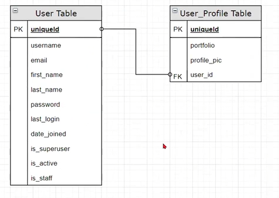

- 1. Kısım ->

# BASE USER PRECLASS SETUP

```bash
# CREATING VIRTUAL ENVIRONMENT
# windows
py -m venv env
# windows other option
python -m venv env
# linux / Mac OS
vitualenv env

# ACTIVATING ENVIRONMENT
# windows
.\env\Scripts\activate
# linux / Mac OS
source env/bin/activate

# PACKAGE INSTALLATION
# if pip does not work try pip3 in linux/Mac OS
pip install django
# alternatively python -m pip install django
pip install python-decouple
pip install pillow
pip install django-crispy-forms
pip freeze > requirements.txt or


django-admin --version
django-admin startproject main .
```


////////////////////////////////////////////////////////
Biz projeyi cloneladığımız için bunları yaptık.

```bash
pip install -r requirements.txt
py -m pip install --upgrade pip
.gitignore
.env
secret_key
py manage.py migrate
py manage.py runserver
```
////////////////////////////////////////////////////////


go to terminal

```bash
py manage.py runserver
```

click the link with CTRL key pressed in the terminal and see django rocket.

go to terminal, stop project, add app

```
py manage.py startapp users
```

go to settings.py and add 'users' app and 'crispy_forms' to installed apps and add below lines

```python
import os

INSTALLED_APPS = [
    'django.contrib.admin',
    'django.contrib.auth',
    'django.contrib.contenttypes',
    'django.contrib.sessions',
    'django.contrib.messages',
    'django.contrib.staticfiles',
    # 3rd party apps,
    'crispy_forms',
    # my apps
    'users',
]

MEDIA_ROOT = os.path.join(BASE_DIR, 'media')
MEDIA_URL = '/media/'

CRISPY_TEMPLATE_PACK = 'bootstrap4'
```

create these folders at project level as /media/profile_pics

create template folder as users/templates/users

base.html

```html
<!DOCTYPE html>


<html lang="en">
  <head>
    <meta charset="UTF-8" />
    <meta http-equiv="X-UA-Compatible" content="IE=edge" />
    <meta name="viewport" content="width=device-width, initial-scale=1.0" />

    <link
      rel="stylesheet"
      href="https://maxcdn.bootstrapcdn.com/bootstrap/4.0.0-alpha.6/css/bootstrap.min.css"
      integrity="sha384-rwoIResjU2yc3z8GV/NPeZWAv56rSmLldC3R/AZzGRnGxQQKnKkoFVhFQhNUwEyJ"
      crossorigin="anonymous"
    />

    
    <link rel="stylesheet" href=" " />
    

    <link rel="stylesheet" href="   " />

    <title>Document</title>
  </head>

  <body>
    
    <div style="margin-top: 100px; margin-bottom: 100px" class="container">
        
      <div class="alert alert-danger">{{ message }}</div>
      
      <div class="alert alert-{{ message.tags }}">{{ message }}</div>
          
    </div>
    <script
      src="https://code.jquery.com/jquery-3.2.1.slim.min.js"
      integrity="sha384-KJ3o2DKtIkvYIK3UENzmM7KCkRr/rE9/Qpg6aAZGJwFDMVNA/GpGFF93hXpG5KkN"
      crossorigin="anonymous"
    ></script>
    <script
      src="https://cdnjs.cloudflare.com/ajax/libs/popper.js/1.12.9/umd/popper.min.js"
      integrity="sha384-ApNbgh9B+Y1QKtv3Rn7W3mgPxhU9K/ScQsAP7hUibX39j7fakFPskvXusvfa0b4Q"
      crossorigin="anonymous"
    ></script>
    <script
      src="https://maxcdn.bootstrapcdn.com/bootstrap/4.0.0/js/bootstrap.min.js"
      integrity="sha384-JZR6Spejh4U02d8jOt6vLEHfe/JQGiRRSQQxSfFWpi1MquVdAyjUar5+76PVCmYl"
      crossorigin="anonymous"
    ></script>
    <script src=""></script>
  </body>
</html>
```

home.html

```html
 
<h1>Home Page</h1>

<h2>Wellcome {{request.user}}!</h2>

<h2>Wellcome Guest!</h2>
 
```

register.html

```html
  

<h2>Registration Form</h2>



<h3>Thanks for registering</h3>



<h3>Fill out the form please!</h3>
<form action="" method="post" enctype="multipart/form-data">
   {{ form_user | crispy }} {{ form_profile | crispy }}
  <button type="submit" class="btn btn-danger">Register</button>
</form>
 
```

user_login.html

```html
  

<div class="row">
  <div class="col-md-6 offset-md-3">
    <h3>Please Login</h3>

    <form action="" method="post">
       {{form|crispy}}
      <button type="submit" class="btn btn-danger">Login</button>
    </form>
  </div>
</div>

```

navbar.html

```html
 

<nav class="navbar navbar-toggleable-md navbar-inverse fixed-top bg-inverse">
  <button
    class="navbar-toggler navbar-toggler-right"
    type="button"
    data-toggle="collapse"
    data-target="#navbarCollapse"
    aria-controls="navbarCollapse"
    aria-expanded="false"
    aria-label="Toggle navigation"
  >
    <span class="navbar-toggler-icon"></span>
  </button>
  <a class="navbar-brand" href=""
    >

    Clarusway FS</a
  >

  <div class="collapse navbar-collapse" id="navbarCollapse">
    <ul class="navbar-nav mr-auto">
      <li class="nav-item active">
          
        <a class="nav-link" href="">Students</a>
      </li>
      <li class="nav-item active">
        <a class="nav-link" href="">Contact</a>
      </li>
    </ul>

    <ul class="navbar-nav ml-auto">
       

      <li class="nav-item active">
        <a class="nav-link" href="/admin">Admin</a>
      </li>
      

      <li class="nav-item active">
          
        <a class="nav-link" href="">Log Out</a>
      </li>
      

      <li class="nav-item active">
          
        <a class="nav-link" href="">Log In</a>
      </li>
      
      <li class="nav-item active">
          
        <a class="nav-link" href="">Register</a>
      </li>
    </ul>
  </div>
</nav>
```

create folder under users/static/users/images

copy cw_logo to this folder

go to users.views.py

```python
from django.shortcuts import render, redirect, HttpResponse

from django.contrib import messages

# Create your views here.

def home(request):
    return render(request, 'users/home.html')
```

go to main/urls.py

```python
from django.contrib import admin
from django.urls import path, include
from users.views import home
from django.conf.urls.static import static
from django.conf import settings

urlpatterns = [
    path('admin/', admin.site.urls),
    path('', home, name='home'),
    path('users/', include('users.urls')),
] + static(settings.STATIC_URL, document_root=settings.STATIC_ROOT) + static(settings.MEDIA_URL, document_root=settings.MEDIA_ROOT)
```

go to users.urls.py

```python
from django.urls import path

urlpatterns = [
]
```

go to terminal and run server

```bash
py manage.py runserver
```

## gitignore

add a gitignore file at same level as env folder, and check that it includes .env and /env lines

## Python Decouple

create a new file and name as .env at same level as env folder

copy your SECRET_KEY from settings.py into this .env file. Don't forget to remove quotation marks from SECRET_KEY

```
SECRET_KEY = django-insecure-)=b-%-w+0_^slb(exmy*mfiaj&wz6_fb4m&s=az-zs!#1^ui7j
```

go to settings.py, make amendments below

```python
from decouple import config

SECRET_KEY = config('SECRET_KEY')
```

# INCLASS STARTS

## Extending the Default User Model

1. Using a Proxy Model
2. Creating a New Table and Using OneToOneField with User Model
3. Adding New Fields to Default User by Using AbstractUser
4. Redefining Default User from Scratch by Using AbstractBaseUser


- Djangonun default user tablosunda bulunan fields lar:

Biz şuana kadar username, email, first name, last name, password ü kullandık. Aşağıdakileri görmüyoruz, bunları admin deashboard da görebiliriz. Bunların bir kısmını kendisi otomatik kaydediyor.
Ancak bir user ın ilave fields lara ihtiyacı olabiliri mesela profile picture, number, portfolio  page vs. İlave fields lara ihtiyaç varsa bir customisation yapmamız lazım. Mevcut durum ilave fieldları karşılamıyor. Bunun için ; bilinen, en çok kullanılan, 4 tane yöntem var.

1. Using a Proxy Model
2. Creating a New Table and Using OneToOneField with User Model (yani filed tablosu ouşturup OneToOneField ile user modelimizi kullanmak. )
3. Adding New Fields to Default User by Using AbstractUser 
   (Default User AbstractBaseUser dan türetilmiş bir user. Biz default user ı yeniden yazarak ona yeni fields lar ekleyebiliriz. AbstractUser ı çağırırız hangi fields lara ihtiyacımız varsa onları tanımlarız. Bu çözüm daha pratik bir çözüm. Biz 3. ve 4. sünü öğreneceğiz.)
4. Redefining Default User from Scratch by Using AbstractBaseUser
   (Bu biraz farklı; Djangonu default user ına biz hangi field la login oluyoruz? username ile login oluyorduk. ama gerçek hayatta siteler email field ile login ediyorlar. Şimdi biz default user daki username yerine email ile login olmasını istiyorsak, uniq field ı email olarak belirlemek istiyorsak, herşeyi sıfırdan tanımlamamız gerekiyor. Bu herşeyi sıfırdan tanımlama işlemini ise AbstractBaseUser ile yapıyoruz.)


- Biz bugün sıfırdan tamamen yeni bir user tanımlama ve user a ilave özellikler kazandırma konularını göreceğiz. 


## Adding New Fields to Default User by Using AbstractUser

- AbstractUser ı çağırıp ilave fields lar ekleyeceğiz.

<users/models.py> a gidip AbstractUser ı django.contrib.auth.models dan import ediyoruz. Bir class tanımlıyoruz, ismi User, nerden türetiyoruz? AbstractUser dan inherit ediyoruz, bana ne fields lar lazımdı? portfolio (bir URL) ve profile_pic ekliyoruz. Şimdi AbstractUser ın içerisinde neler var merak ediyoruz. Üzerine mousla gelip control e basılı tutunca link çıkmaya başladı.

go to users/models.py

```python
from django.db import models
from django.contrib.auth.models import AbstractUser
# Create your models here.

class User(AbstractUser):
    portfolio = models.URLField(blank=True)
    profile_pic = models.ImageField(upload_to='profile_pics', blank=True)
```

Bundan sonra <settings.py> a gidip bir ayar yapmamız gerekiyor. En alta <AUTH_USER_MODEL = 'users.User'> yazıyoruz. Burada "User olarak artık benim users app imin içinde hazırladığım User ımı kullan" diyoruz.

go to settings.py and add below line

```python
AUTH_USER_MODEL = 'users.User'
```

Bir model tanımlayınca bizim onu dashboard da görebilmemiz için <admin.py> a gidip admin.site.register(User) yapmamız gerekiyor.

go to users/admin.py

```python
from django.contrib import admin
from .models import User
# Register your models here.
admin.site.register(User)
```

Ardından bir model tanımlayınca djangonun db ye kaydetmesi için terminalden yazmamız gereken komutları yazıyoruz. ->

go to terminal ->
```bash
py manage.py makemigrations
py manage.py migrate
```

Şimdi bir de superuser oluşturalım; ->
go to terminal ->
```bash
py manage.py createsuperuser
```

(Sorun yaşayanlar oldu; terminalde deactivate yapıp env kapatıyoruz, env klasörünü siliyoruz, dbsqlite3 yi de siliyoruz. Yeniden env kuruyoruz, activate ediyoruz, requirements i kuruyoruz, upgrade ediyoruz. makemigrations ve migrate işlemlerini yapıp runserver la serverı çalıştırıyoruz. db yi sildiğimiz için superuser oluşturmamız gerekiyor. )

Şimdi birkaç views yazalım. users ın <views.py> ını açıyoruz. Burada bize kullanıcıyı register edebileceğimiz bir view lazım. def register ile başlıyoruz. Ancak bunun öncesinde bizim bir form tanımlamamız gerekiyor. Buraya pass deyip; 

go to users/views.py

```py
from django.shortcuts import render, redirect, HttpResponse
from django.contrib import messages

# Create your views here.

def home(request):
    return render(request, 'users/home.html')

def register(request):
    pass

```


users klasörü içinde <forms.py> dosyası oluşturuyoruz. User register için bir form oluşturacağız. models.py dan User modelimizi çağırıyoruz, ne kullanıyorduk biz models.ModelForm kullanıyorduk ama aslında django yine User Creation için hazırladığı bir takım kolay formlar var, bir daha baştan yazmamak için UserCreationForm diye bir fom var. Busefer hazır olduğu için onu kullanacağız. Ne yapıyorduk class UserForm isminde UserCreationForm dan inherit ederek, türeterek oluşturmaya başlıyoruz. Bir class Meta() kullanarak model olarak şunu, fields olarak şunları kullan diyoruz.

go to users/forms.py

```python
from .models import User
from django.contrib.auth.forms import UserCreationForm

class UserForm(UserCreationForm):
    class Meta():
        model = User
        # fields = '__all__'
        fields = ('username', 'email', 'password1', 'password2', 'portfolio', 'profile_pic', 'first_name', 'last_name')
        # exclude = ('is_staff', 'is_active', 'date_joined', 'password', 'last_login', 'is_superuser', 'groups', 'user_permissions', )
```


UserCreationForm u oluşturduk. Şimdi views ime gidip az önce pass dedğimiz register işlemine devam edebiliriz. UserForm u .forms dan import ederek...;
 Ne yapıyoruz register view i için bir form oluşturmuştuk UserForm diye ve bu formu boş olarak çağırıyoruz, request method umuz POST ise (if request.method == 'POST':) bu fromun içerisini dolduracağız. Formun içerisini nasıl dolduruyorduk? > requestten gelen bilgilerle dolduruyorduk, requestten bana hangi bilgilerin gelmesini bekliyorum? (request.POST) ve ayrıca file işlemi yaptığı için çünkü kullanıcının dosya yükleme ihtimali de var onun için de request.FILES ı da ekliyoruz (request.POST, request.FILES).
 Artık form geldi ilk yapmamız gereken şey valid mi sorgulamak. if form.is_valid() form valid olarak geldi ise bunu form.save() etmemiz lazım.
 Şimdi burada işlemi bitirebiliriz ama ilave işlemler de yapabiliriz.Yani normalde bi kişi register olduktan sonra biz onu login de yapabiliriz.Peki nasıl yapacağız, formun içinden username i almamız lazım şu şekilde alıyoruz > username = form.cleaned_data['username'] , başka ne lazım password lazım password = form.cleaned_data['password1'] password1 diyoruz çünkü 2 tane password alanı var bir tanesi password2 diye geçen confirmation alanı. Sonra bu user geçerli bir user mı onu kontrol etmem lazım, geçen dersten aut diye bir komutum var. django.contrib.auth dan authenticate i import ediyoruz, bir de authenticate olduktan sonra o kişiyi login yapacağız o yüzden login i de import ediyoruz. Buraya kadar username i va password ü aldık ilk önce böyle bir user var mı onu kontrol edeceğiz.
 user = authenticate(username=username,password=password) böyle bir kullanıcı sayfaya girmeye yetkili ise, db bu kişiye onay veriyorsa o zaman bu user dolu olarak gelecek o zamanda biz işlemi yapabileceğiz nasıl yapazcağız > bu kullanıcıyı login et > login(request, user)
 Burada işlemlerim bitti redirect yapmam lazım nereye redirect yapayım home page e redirect yapayım return redirect('home') .
 Buradaki if lerden çıkıp bir context oluşturmam lazım context = {'form_user':form} sonrasında return render(request, 'users/register.html', context)
 Eğer gelen request GET request ise form valid değilse o zaman boş formu veya hatalarla birlikte gelen formu context e atayıp register template ime gönderiyorum.


go to users/views.py

```py
from django.shortcuts import render, redirect, HttpResponse
from django.contrib import messages
from .forms import UserForm
from django.contrib.auth import authenticate, login

# Create your views here.

def home(request):
    return render(request, 'users/home.html')

def register(request):
    form = UserForm()
    if request.method == 'POST':
        form = UserForm(request.POST, request.FILES)
        if form.is_valid():
          form.save()
          # username = form.cleaned_data['username']
          username = form.cleaned_data.get('username')
          # password = form.cleaned_data['password1']
          password = form.cleaned_data.get('password1')
          user = authenticate(username=username, password=password)
          login(request, user)
          return redirect('home')
    context={
      'form_user':form
    }
    return render(request, 'users/register.html', context)

```

urls.py gidiyoruz, şu anda bizim urls paternimiz boş, dolduruyoruz. ->
go to urls.py

```py
from django.urls import path
from .views import register

urlpatterns = [
    path('register/', register, name='register'),
]

```
Artık bizi homepage de name imizle karşılıyor, çünkü biz admin dashboard dan login olmuştuk, bizi artık tanıyor.
Şimdi admin page den üst en sağdan logout işlemi yapalım, ardından home page e gidp refresh edince bize bu sefer Welcome guest diyor, login olmadığımız için çünkü tanımıyor.
Register a tıkladım ama çalışmıyor niye çünkü tanımlı değil. Onun için templates iminiçierisinde bu url lerimi aktif hale getirmem lazım. Templates klasörümüze gidiyorum, burada <navbar.html> diye bir template imiz var, içinde register ı buluyoruz ve href 'i boş, bir üst satırda comment içine aldığımız  ı kopyalayıp href kısmına yazıyoruz.

<navbar.html> ->

```py


<nav class="navbar navbar-toggleable-md navbar-inverse fixed-top bg-inverse">
    <button class="navbar-toggler navbar-toggler-right" type="button" data-toggle="collapse"
        data-target="#navbarCollapse" aria-controls="navbarCollapse" aria-expanded="false"
        aria-label="Toggle navigation">
        <span class="navbar-toggler-icon"></span>
    </button>
    <a class="navbar-brand" href="">

        Clarusway FS</a>

    <div class="collapse navbar-collapse" id="navbarCollapse">
        <ul class="navbar-nav mr-auto">
            <li class="nav-item active">
                  
                <a class="nav-link" href="">Students</a>
            </li>
            <li class="nav-item active">
                <a class="nav-link" href="">Contact</a>
            </li>
        </ul>

        <ul class="navbar-nav ml-auto">
             

            <li class="nav-item active">
                <a class="nav-link" href="/admin">Admin</a>
            </li>
            

            <li class="nav-item active">
                  
                <a class="nav-link" href="">Log Out</a>
            </li>
            

            <li class="nav-item active">
                  
                <a class="nav-link" href="">Log In</a>
            </li>
            
            <li class="nav-item active">
                  
                <a class="nav-link" href="">Register</a>
            </li>
        </ul>
    </div>
</nav>
```

save edip home page imizi yeniliyoruz, register linkine tıklıyoruz ve register formumuz artık geliyor. İstenen bilgileri girip register olup login olup home page geliyoruz.
Buraya yani home page e de logout koyalım, admine gitmeden buradan da logout yapalım. <views.py> a gidelim ve buraya da bir logout view ü yazalım, tabi view de logout var onun için logout u da import etmemiz lazım;

<views.py> ->

```py
from django.shortcuts import render, redirect, HttpResponse
from django.contrib import messages
from .forms import UserForm
from django.contrib.auth import authenticate, login, logout

# Create your views here.

def home(request):
    return render(request, 'users/home.html')

def register(request):
    form = UserForm()
    if request.method == 'POST':
        form = UserForm(request.POST, request.FILES)
        if form.is_valid():
          form.save()
          # username = form.cleaned_data['username']
          username = form.cleaned_data.get('username')
          # password = form.cleaned_data['password1']
          password = form.cleaned_data.get('password1')
          user = authenticate(username=username, password=password)
          login(request, user)
          return redirect('home')
    context={
      'form_user':form
    }
    return render(request, 'users/register.html', context)

def user_logout(request):
    messages.success(request, 'You Logout!')
    logout(request)
    return redirect('home')

```

Bunu urls.py da da tanımlamamız lazım, views.py dan user_logout u import edip, path ini yazıyoruz, name için template de ne dediğimiz önemli template ismine de bakmamız lazım, navbar.html e gidip orada da logout demişiz, burada ismini logout yazıyoruz. .;

<urls.py> ->

```py
from django.urls import path
from .views import register, user_logout

urlpatterns = [
    path('register/', register, name='register'),
    path('logout/', user_logout, name='logout'),
]
```

Sonra yine template imize gidiyoruz, bu arada template imiz <navbar.html> dir. Log Out linki içindeki href kısmına  yazıyoruz.

<navbar.html> ->

```py



<nav class="navbar navbar-toggleable-md navbar-inverse fixed-top bg-inverse">
    <button class="navbar-toggler navbar-toggler-right" type="button" data-toggle="collapse"
        data-target="#navbarCollapse" aria-controls="navbarCollapse" aria-expanded="false"
        aria-label="Toggle navigation">
        <span class="navbar-toggler-icon"></span>
    </button>
    <a class="navbar-brand" href="">

        Clarusway FS</a>

    <div class="collapse navbar-collapse" id="navbarCollapse">
        <ul class="navbar-nav mr-auto">
            <li class="nav-item active">
                  
                <a class="nav-link" href="">Students</a>
            </li>
            <li class="nav-item active">
                <a class="nav-link" href="">Contact</a>
            </li>
        </ul>

        <ul class="navbar-nav ml-auto">
             

            <li class="nav-item active">
                <a class="nav-link" href="/admin">Admin</a>
            </li>
            

            <li class="nav-item active">
                  
                <a class="nav-link" href="">Log Out</a>
            </li>
            

            <li class="nav-item active">
                  
                <a class="nav-link" href="">Log In</a>
            </li>
            
            <li class="nav-item active">
                  
                <a class="nav-link" href="">Register</a>
            </li>
        </ul>
    </div>
</nav>

```

save edip, homepage imizi refresh ettik ve logout linkine tıkladığımızda logout olduğumuzu gördük.


login linki oluşturacağız homepage de;

Şimdi <views.py> a gidiyoruz, django.contrib.auth.forms dan AuthenticationForm u import ememiz lazım,

<views.py> ->

```py

from django.shortcuts import render, redirect, HttpResponse
from django.contrib import messages
from .forms import UserForm
from django.contrib.auth import authenticate, login, logout
from django.contrib.auth.forms import AuthenticationForm


# Create your views here.

def home(request):
    return render(request, 'users/home.html')

def register(request):
    form = UserForm()
    if request.method == 'POST':
        form = UserForm(request.POST, request.FILES)
        if form.is_valid():
          form.save()
          # username = form.cleaned_data['username']
          username = form.cleaned_data.get('username')
          # password = form.cleaned_data['password1']
          password = form.cleaned_data.get('password1')
          user = authenticate(username=username, password=password)
          login(request, user)
          return redirect('home')
    context={
      'form_user':form
    }
    return render(request, 'users/register.html', context)

def user_logout(request):
    messages.success(request, 'You Logout!')
    logout(request)
    return redirect('home')

def user_login(request):
    form = AuthenticationForm(request, data=request.POST)
    if form.is_valid():
        user= form.get_user()
        if user:
            messages.success(request, 'Login successfull')
            login(request, user)
            return redirect('home')
    return render(request, 'users/user_login.html', {'form':form})

```


<urls.py> da path ini oluşturuyoruz, gösteriyoruz, name ini de verdik, -> 

<urls.py> -> 

```py
from django.urls import path
from .views import register, user_logout, user_login

urlpatterns = [
    path('register/', register, name='register'),
    path('logout/', user_logout, name='logout'),
    path('login/', user_login, name='user_login'),
]

```


<navbar.html> template ine gidip işlem yapmamız lazım, login href ini doldurmamız lazım;

<navbar.html> ->

```py



<nav class="navbar navbar-toggleable-md navbar-inverse fixed-top bg-inverse">
    <button class="navbar-toggler navbar-toggler-right" type="button" data-toggle="collapse"
        data-target="#navbarCollapse" aria-controls="navbarCollapse" aria-expanded="false"
        aria-label="Toggle navigation">
        <span class="navbar-toggler-icon"></span>
    </button>
    <a class="navbar-brand" href="">

        Clarusway FS</a>

    <div class="collapse navbar-collapse" id="navbarCollapse">
        <ul class="navbar-nav mr-auto">
            <li class="nav-item active">
                  
                <a class="nav-link" href="">Students</a>
            </li>
            <li class="nav-item active">
                <a class="nav-link" href="">Contact</a>
            </li>
        </ul>

        <ul class="navbar-nav ml-auto">
             

            <li class="nav-item active">
                <a class="nav-link" href="/admin">Admin</a>
            </li>
            

            <li class="nav-item active">
                  
                <a class="nav-link" href="">Log Out</a>
            </li>
            

            <li class="nav-item active">
                  
                <a class="nav-link" href="">Log In</a>
            </li>
            
            <li class="nav-item active">
                  
                <a class="nav-link" href="">Register</a>
            </li>
        </ul>
    </div>
</nav>

```


Özet olarak ne yaptık bu derste bir User modeli tanımlamıştık, User a yeni field eklemek istedik, portfolio ve profile_pic bu ikisi bize yeterli dedik. Bu dersin konusu User a ilave field lar kazandırmaktı.

<models.py> ->

```py
from django.db import models
from django.contrib.auth.models import AbstractUser

# Create your models here.

class User(AbstractUser):
    portfolio = models.URLField(blank=True)
    profile_pic = models.ImageField(upload_to='profile_pics', blank=True)

```


Sonrasında yeni bir user oluşturmak istedik, bunun bize form lazım ve UserCreationForm dan bir UserForm inherit ettik. Hangi modeli kullanacaksak model = onu yazdık ve hangi fieldları kullanacaksak onları yazdık.

<forms.py> ->

```py

from .models import User
from django.contrib.auth.forms import UserCreationForm

class UserForm(UserCreationForm):
    class Meta():
        model = User
        # fields = '__all__'
        fields = ('username', 'email', 'password1', 'password2', 'portfolio', 'profile_pic', 'first_name', 'last_name')
        # exclude = ('is_staff', 'is_active', 'date_joined', 'password', 'last_login', 'is_superuser', 'groups', 'user_permissions', )

```


Sonra <views.py> a gelip tek tek views lerimizi yazdık. Ne yazdık register view yazdık. Burada naming convension çok önemli, bizim zaten şuanda logout diye bir fonksiyonumuz var, nerden geliyor bu djangonun kendi modellerinden geliyor. Eğer siz aynı isimde bir fonksiyonla bunu ezmeye çalışırsanız o zaman sıkıntı yaşarız. Burada def logout diyemeyiz, def user_logout dememiz gerekir. register view in ismini register diye verebiliriz çünkü bu view ü biz yazdık bize ait birşey, ancak logout view ünü yazarken def logout diye başlayıp bir logout view ü yazamayız. Çünkü logout diye tanımlı bir şey var djangoda ve onu import ettik, bir daha logout diye bir fonksiyon yazarsak sıkıntı yaşarız. o yüzden biz bu view ün ismini user_logout diyoruz. Bizim kullandığımız ısımlerle default name lerin çakışmaması lazım.
Son olarak ne yaptık user_login sayfası oluşturduk, burda formu biz kendimiz yazmadık, form olarak hazır form kullandık. Zaten djangonun AuthenticationForm isimli bir formu var, import edip onu kullandık burada. Bu AuthenticationForm ne istiyor bizden? AuthenticationForm(request, data=request.POST) diğer formlardan farklı olarak (diğer formlarda biz bilgi gönderirken biz neyle gönderiyorduk mesela UseForm(request.POST, request.FILES) diyorduk) 1-request i istiyor, 2- data altında request.POST u istiyor. Bu formun yapısı bu, AuthenticationForm kullandığımız zaman ilk parametre request, ikinci parametre data=request.POST istiyor.
Yine form valid mi diye baktık. Sonra AuthenticationForm un get_user() diye bir şeyi var. form.get_user() ile şuanki user bilgisini aldık
Biz kendi yazdığımız register view ünde authenticate(username=username, password= password) diye bir komut kullanmıştık. Ama AuthenticationForm kullandığımızda form valid ise authenticate işlemini  kendi yapıyor. authenticate işlemini otomatik yaptıktan sonra da bu bilgiyi form.get_user() ile bize verebiliyor.
user bilgisini alıp messages işlemi yapıp, login işlemi yap, home a döndür diyoruz if yapısıyla
(Yine bezer şekilde login yaparak ana sayfama geri döndürüyorum.)
(Bir de messages paketi var bunu önceki derslerde görmüştük.)

<views.py> ->

```py

from django.shortcuts import render, redirect, HttpResponse
from django.contrib import messages
from .forms import UserForm
from django.contrib.auth import authenticate, login, logout
from django.contrib.auth.forms import AuthenticationForm


# Create your views here.

def home(request):
    return render(request, 'users/home.html')

def register(request):
    form = UserForm()
    if request.method == 'POST':
        form = UserForm(request.POST, request.FILES)
        if form.is_valid():
          form.save()
          username = form.cleaned_data.get('username')
          password = form.cleaned_data.get('password1')
          user = authenticate(username=username, password=password)
          login(request, user)
          return redirect('home')
    context={
      'form_user':form
    }
    return render(request, 'users/register.html', context)

def user_logout(request):
    messages.success(request, 'You Logout!')
    logout(request)
    return redirect('home')

def user_login(request):
    form = AuthenticationForm(request, data=request.POST)
    if form.is_valid():
        user= form.get_user()
        if user:
            messages.success(request, 'Login successfull')
            login(request, user)
            return redirect('home')
    return render(request, 'users/user_login.html', {'form':form})

```


- 2. Kısım ->

User yerine e-mail tanımlayacağız.

## Redefining Default User from Scratch by Using AbstractBaseUser
(AbstractBaseUser Kullanarak Varsayılan Kullanıcıyı Sıfırdan Yeniden Tanımlamak)

1.kısımdan tamamen ayırmak için aşağıdaki dosyaları siliyoruz.

delete env/ folder
delete db.sqlite3
delete 0001_initial.py under users/migrations


Silme işleminden sonra tekrar env kuruyoruz, active ediyoruz.
Then go to terminal ->

```bash
py -m venv env
./env/Scripts/activate
pip install -r requirements.txt
py -m pip install --upgrade pip
```

makemigrations ve migrate yapmadan önce user ı yeniden tanımlayacağız. user yerine e-mail tanımlayacağız.


Şimdi <models.py> ımıza gidiyoruz. AbstractBaseUser üzerinden yapacağız, bunun için AbstractBaseUser, PermissionsMixin i import ediyoruz. django.contrib.auth.base_user da da BaseUserManager ı import ediyoruz.
Şimdi bizim iki tane class tanımlamamız lazım.
class User ı yeniden yazalım. Daha önce AbstractUser dan inherit etmiştik, şimdi herşeyi sıfırdan yapacağımız için AbstractBaseUser dan ve de permission işlemlerinin tutulduğu PermissionsMixin kütüphanemiz var bu iki class tan User class ımızı türetiyoruz, inherit ediyoruz.
Artık User class ında fields ların hepsini yeniden tanımlamak zorundayız. Normalde AbstractUser ın içerisinde vardı ama AbstractBaseUser içerisinde email yok.
email = models.EmailField('email address', unique=True)
AbstractUser ın içerisinde username, email, first, last name, password ü başka yerden alacağız, last_joined, date_joined başka yerlerden gelecek, is_superuser, is_active, is_staff bu üçünü yapmamız lazım.Aşağıda yapıyoruz.
username field olarak ne kullanacaksak onu belirtmemiz gerekiyor. USERNAME_FIELD = 'email'  username field ı olarak artık email i kullan.
REQUIRED_FIELDS = [] ilave fields istiyorsak buraya yazıyoruz, şu and aistemiyoruz oyüzden boş olarak yazdık, görüntü.
objects i menager vasıtasıyla yazıyoruz ama bizim menager ımız olmadığı için yoruma alıyoruz.
str metodumuzu yazıyoruz.
sıralama önemli olduğu için objects kısmına bir base menager atayacağımız için bunun öncesinde bir base menager tanımlamamız lazım. class User ın öncesine gidiyoruz.
class CustomUserManager(BaseUserManager)
    pass
artık ismen de olsa bir manager imiz var, objects i yorumdan kurtarıp objects = CustomUserManager()  diyoruz.
şimdi yukarıda manager ı tanımlayacağız. Manager user create işlemi ve superusercreate işlemi yapıyor. onların fonksiyonunu tamamlamamız lazım. Önce usercreate işlemini manager a yaptıralım. def create_user(self, email, password, **extra_fields):      user oluştururken gelmesi gereken fieldları yazıyoruz parantez içine, iki tanesi mecburi gelmesi gerekiyor, diğerleri opsiyonel. Bir aşağıda if içerisinde onları kontrol ediyoruz.
Kriterler default olarak djangodan, settings.py daki password validators da yapıyor ama biz hazır class ları kullanırdsk yapıyor. biz eğer model form da sıfırdan bir form yazarsak onları yapmaz. Biz UserCreationForm kullandık, UserCreationForm içerisinde bunları yapıyor. Ama biz kendi formumuzu kullanırsak, yeni bir form oluşturursak bu sefer validatorsları da bizim oraya ilişkilendirmemiz gerekir. Formumuzu UserCreationForm dan türettğimiz müddetçe sıkıntı yok. Ama modelsFormdan türetirsek bu validatorsu kendimiz yapmak durumunda kalırız.
Şimdi usercreate işlemi yaptık. Bir de bizim ekstra bir superuser ımız var. onu yapıyoruz. Hani terminalden createsuperuser yazıyoruz ya işte o zaman buraya yazdıklarımız çalışıyor. def create_superuser(self, email, password, **extra_fields)     burada superuser oluşturduğumuz için extra_fields ların içerisinde is_staff, is_active, is_superuser yoksa bunların default değerlerini setdefault('is_staff', True) şeklinde True yapmamız gerkir.
Eğer kullanıcı bu fieldları bana gönderdiyse ve kasıtlı olarak False yaptıysa benim sistemimizin çökmemesi için onu uyarmam lazım. if extra_fields.get('is_staff') is not True:   ile de hata mesajı döndürüyoruz.
Kontrol işlemlerim bitince create işleminde bunu yaptıracağız: -> return self.create_user(email, password, **extra_fields)    gönderiyoruz.
BaseManager işlemleri de bu kadar. Ne yapıyor? bize kullanıcı oluşturma hizmeti veriyor. Öncelikle create user nasıl oluşturulacak ona baktık, bizim için burda önemli olan email ve password ün mutlaka geliyor olması lazım, email geldi mi diye kontrol ediyoruz, gelmediyse hata döndürüyoruz, geldiyse bunu küçük harf normal email formatına çeviriyoruz, sonra modelimize göre yeni bir user oluşturuyoruz.Oluşturduğumuz bu user a set_password ile password ü şifreli bir şekilde ekleyip save edip user ı return ediyoruz.
superuser da ise bize üç tane field mutlaka gerekli, is_stuff, is_active, is_superuser bunları yoksa ekliyoruz True şeklinde, varsa ve False geldiyse ikaz ediyoruz ValueError veriyoruz, True ise return self.create_user diyerek hemen yukarıda tanımladığımız fonksiyona havale edip usercreate işlemini yaptırıyoruz.

go to users.models.py ->

```python

from django.db import models
from django.contrib.auth.models import AbstractUser, AbstractBaseUser, PermissionsMixin
from django.contrib.auth.base_user import BaseUserManager
# Create your models here.

# class User(AbstractUser):
#     portfolio = models.URLField(blank=True)
#     profile_pic = models.ImageField(upload_to='profile_pics', blank=True)

class CustomUserManager(BaseUserManager):
    def create_user(self, email, password, **extra_fields):
        if not email:
            raise ValueError('Email field is mandatory')
            # eğer email yoksa hata mesajı döndür.
        email=self.normalize_email(email)
        # email formatına çeviriyor
        user=self.model(email=email, **extra_fields)
        user.set_password(password)
        # password ü kriptolaması için böyle yazdık
        user.save()
        return user
    
    def create_superuser(self, email, password, **extra_fields):
        extra_fields.setdefault('is_staff', True)
        extra_fields.setdefault('is_active', True)
        extra_fields.setdefault('is_superuser', True)
        
        if extra_fields.get('is_staff') is not True:
            raise ValueError('Superuser must have is_staff True')
        if extra_fields.get('is_active') is not True:
            raise ValueError('Superuser must have is_active True')
        if extra_fields.get('is_superuser') is not True:
            raise ValueError('Superuser must have is_superuser True')
        
        return self.create_user(email, password, **extra_fields)
    

class User(AbstractBaseUser, PermissionsMixin):
    email=models.EmailField('email address', unique=True)
    is_staff=models.BooleanField(default=False)
    is_active=models.BooleanField(default=True)
    date_joined=models.DateTimeField(auto_now_add=True)
    # ilk kayıt işleminin tarihini kaydet
    # auto_add=True güncelleme işleminin tarihini kaydet
    # superuser PermissionMixin içinden geliyor, o yüzden yeniden tanımlamıyoruz.
    # password, last_login  AbstractBaseUser içinden geliyor,
    # first_name, last_name bu projede koymayacağız istersek koyabiliriz.
    
    USERNAME_FIELD = 'email'
    REQUIRED_FIELDS = []
    
    objects = CustomUserManager()
    
    def __str__(self):
        return self.email

```


<forms.py> a gidiyoruz, burada değişiklik yapmamız lazım. UserForm da fields larımız arasında artık username diye bir field ımız yok, portfolio, profile_pic, first_name, last_name de yok. Bunların yerine biz fields ı yeniden tanımlıyoruz.
yeni  fields = ('email', 'password1', 'password2')     böyle oldu.

<forms.py> ->

```py
from .models import User
from django.contrib.auth.forms import UserCreationForm

class UserForm(UserCreationForm):
    class Meta():
        model = User
        # fields = ('username', 'email', 'password1', 'password2', 'portfolio', 'profile_pic', 'first_name', 'last_name')
        fields = ('email', 'password1', 'password2')

```


Artık makemigrations ile başlayalım,

go to terminal ->

```bash
py manage.py makemigrations
py manage.py migrate
py manage.py createsuperuser
py manage.py runserver
```


Sıfırdan user modeli tanımladık ve artık bunu kullanabiliyoruz.


/*****************************************************/
Buradan aşağısını anlamadım.
Derste anlatılmadı.
/*****************************************************/


go to account.admin.py

```python
from django.contrib import admin

# Register your models here.
from django.contrib.auth.admin import UserAdmin
from .models import User
from .forms import UserForm, CustomUserChangeForm


class CustomUserAdmin(UserAdmin):
    add_form = UserForm
    form = CustomUserChangeForm
    model = User
    list_display = ('email', 'is_staff', 'is_active', 'is_superuser')
    list_filter = ('email', 'is_staff', 'is_active', 'is_superuser')
    fieldsets = (
        (None, {'fields': ('email', 'password')}),
        ('Permissions', {'fields': ('is_staff', 'is_active', 'is_superuser')}),
    )
    add_fieldsets = (
        (None, {
            'classes': ('wide',),
            'fields': ('email', 'password1', 'password2', 'is_staff', 'is_active', 'is_superuser')}
         ),
    )
    search_fields = ('email',)
    ordering = ('email',)


admin.site.register(User, CustomUserAdmin)
# admin.site.register(User)

```

go to users.forms.py

```python
from .models import User
from django.contrib.auth.forms import UserCreationForm, UserChangeForm


class UserForm(UserCreationForm):

    class Meta():
        model = User
        # fields = '__all__'
        # fields = ('username', 'email', 'password1', 'password2', 'portfolio', 'profile_pic', 'first_name', 'last_name')  # , 'password1')
        exclude = ('is_staff', 'is_active', 'date_joined', 'password', 'last_login', 'is_superuser', 'groups', 'user_permissions', )

class CustomUserChangeForm(UserChangeForm):

    class Meta:
        model = User
        fields = '__all__'
```

go to users/views.py and amend the line below under def register

```python
# username = form.cleaned_data['username']
username = form.cleaned_data['email']
```

go to terminal

```bash
py manage.py makemigrations
py manage.py migrate
py manage.py createsuperuser
py manage.py runserver
```

navigate to http://localhost:8000/admin/
