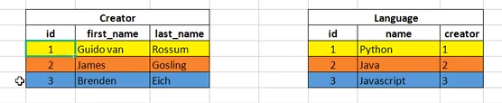
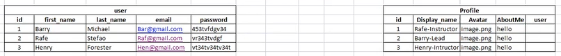
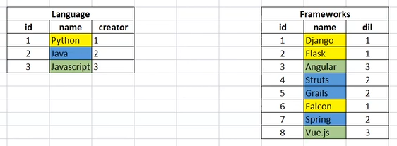
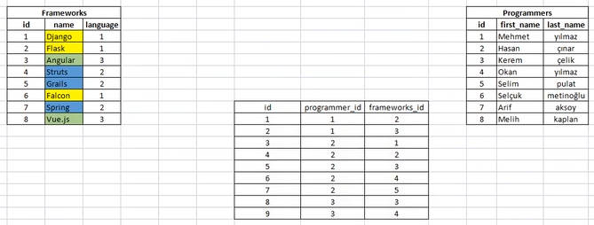

Django tamamen bir web framework. Template ler vasıtasıyla ön yüzü de yapabiliyoruz. 
Django Rest Framework sadece backend e yönelik, endpoint.
Bu end pointleri react ya da başka bir frontend frameworkünde kullanabileceksiniz.

İlk olarak çalışacağımız alanı, environment i ,çevreyi oluşturuyoruz. Bunu niçin yapıyoruz, biz şimdi projemizde paketler yükleyeceğiz, bazı paketleri sadece bu projede kullanacağız, o yüzden biz bu paketleri global imize değil de oluşturacağımız bu environment e yüklüyoruz. 2. sebepte yüklediğimiz package ların versiyonları ile ilgili, projede hangi package ın hangi versiyonu yüklenmiş ise bu environment tan onları görüp çağırıp projeyi açabiliriz. O yüzden globalimizi kullanmayıp, bir virtual environment oluşturup bütün projeyi onu active ederek oluşturuyoruz.


## 1._ders
### create project  and "welcome backend"

$ python --version
$ pip --version

$ python -m venv env    (veya py -m venv env)
$ .\env\Scripts\activate  (deactivate ile de durdurulabilir.)

$ pip install django   # install django and       
(python -m pip install --upgrade pip  # optional -- upgrade pip version     veya 
py -m pip install --upgrade pip)

$ pip freeze    # control 
$ pip freeze > requirement.txt (projenin sonunda da yapılabilir, venv deactivate edildikten sonra tekrar tekrar da yapılabilir)
(pip install -r .\requirements.txt) (Oluşturulmuş bir requirements.txt dosyasından indirme.)

$ django-admin startproject main .    (proje başlatma)

(manage.py bizim django komutlarını çalıştırmaya yarıyor. Bu dosya ile aynı seviyede olmalıyız, komutları çalıştırabilmemiz için.)


create .gitignore    (.gitignore dosyası oluşturuyoruz.)

$ gitignore template (react - django vs) : https://www.toptal.com/developers/gitignore/api/django

$ gitignore template (react - django vs) : https://www.toptal.com/developers/gitignore


create app (app oluşturuyoruz.)

$ python manage.py startapp fscohort # create a app  (veya py manage.py startapp fscohort)
$ add app to installed_apps in settings.py   (app imizi settings.py a kaydediyoruz.)

$ python manage.py runserver      (veya py manage.py runserver)
(terminalde gelen uyarı mesajı -> : Biz settings.py ile gelen default değerlerde değişiklik (app imizi ekledik) yaptığımız için bizden <py manage.py migrate> komutu istiyor. Zaten ilerde o komutu kullanacağımız için bu uyarıyı dikkate almıyoruz.)


(proje <urls.py> ından, app in <urls.py> ına yönlendirme yapıyoruz.) 
- main/urls.py >>>>> include application
  
```
from django.contrib import admin
from django.urls import path, include

urlpatterns = [
    path('admin/', admin.site.urls),
    path('', include("fscohort.urls")),
]
```


(app in <urls.py> ı olmadığı için bir tane <urls.py> dosyası oluşturuyoruz.) 
- fscohort/urls.py >>>> call view

```
from django.urls import path
from .views import home

urlpatterns = [
    path('', home),
]
```


(app in <urls.py> ında <views.py> dan çağırdığımız home views ını oluşturuyoruz. app in <views.py> ında da öncelikle bir HttpResponse döndürüyoruz.) 
- fscohort/views.py

```
from django.shortcuts import render
from django.http import HttpResponse

# Create your views here.

def home(request):
    return HttpResponse("Welcome to Backend")
```


(django relational db lerle daha uyumlu çalışıyor. non-relational db ler ile çalışması için 3rd party package lere ihtiyaç duyuyor. Db ayarları <settings.py> da ilgili kısımda yapılıyor.)$


## 2._ders
### model - create student


-------------- models ----------------


-models.py 'da Student tablosunu oluşturuyoruz;

(modelimizi yani tablomuzu oluşturduktan sonra <py manage.py makemigrations> ve <py manage.py migrate> komutlarını çalıştırıyoruz.)

$ from django.db import models
$ class Student(models.Model):
      first_name = models.CharField(max_length=20)
      last_name = models.CharField(max_length=30)
      number = models.IntegerField()


admin dashbord umuzu ayağa kaldırıyoruz;
```
py manage.py createsuperuser
```

(admin dashbord umuzda oluşturduğumuz modelimizi yani tablomuzu göremiyoruz. Onun için <admin.py> dosyasına gidip modelimizi <models.py> dan import edip admin.site.register(modelimizin ismi) ni yazmamız gerekiyor. )

```
from django.contrib import admin
from .models import Student

# Register your models here.

admin.site.register(Student)
```

(oluşan dashboard umuzda modelimize eklediğimiz objelerin görünümünü human readable yapmak için __str__ metodumuzu kullanıyoruz. __str__ metodunu yazdığımızda tekrardan makemigrations ve migrate komutlarını çalıştırmamıza gerek yok. Çünkü modelimizde değişiklik yapmıyoruz, sadece görünümünü değiştiriyoruz. Modelde değişiklik yapsaydık bu komutları çalıştırmamız gerekirdi.)

```
from django.db import models
class Student(models.Model):
    first_name = mod........
    ................

    def __str__(self):
        return (f'{self.number} - {self.first_name}')
```


(Bir de object-oriented da gösterilen inner class vardı, bir class ın altına tekrar bir class daha yazabiliyoruz. Burada Meta optionslardan bahsedildi. class Meta: ile )
```
from django.db import models
class Student(models.Model):
    first_name = mod........
    ................

    def __str__(self):
        return (f'{self.number} - {self.first_name}')

    class Meta:
        ordering = ["number"]  (database'de değişiklik yapmıyor.artan numara sırasına göre sıraladı)
        verbose_name_plural = "Student_List"  (db'de dğşklik yapmıyor.Tablonun ismini çoğul olmasını engelliyor)
        db_table = "Student_Table"      (database'de değişiklik yapıyor (tablonun ismini değiştiriyor.) o yüzden makemigrations ve migrate komutlarını çalıştırmamız gerekiyor.)
```

(shell üzerinden ORM sorguları yapacağız. Shell i de normal shell kullanmayacağız biraz daha interaktif olsun diye iki tane paket <django_extensions> ve <ipython> indireceğiz. Bunlar optional. Shell çok kullanılan bir uygulama değil. Ne zaman kullanırız? -> Yeni bir yapı oluşturduk, bu yapı düzgün çalışıyor mu diye hemen açıp denemek için kullanabiliriz.)

(Şimdi temel ORM sorguları yapacağız. Bunun için shell i kullanacağız. Normalde biz queryleri, djangonun logic kısmı views olduğundan views içerisinde yapıyoruz. Views de biz db den ORM sorgularıyla veriyi çekip template lere gönderiyoruz veya endpoint yazmışsak, API yazmışsak oraya gönderiyoruz.)
(ORM -> Object Relational Mapping diye geçiyor. Arka planda hangi db ye bağlanırsak bağlanalım MySQL, Oracle, PostgreSQL farketmez ORM sayesinde aynı komutularla query lerle istediğimiz veriyi çekebiliyoruz. Arkadaki db den bağımsız olarak python code larıyla veriyi çekebiliyoruz.)
(Normalde biz ORM sorgularını views de yapıyorduk, ama şimdi biz views e girmediğimiz için shell i kullanacağız, shell de de yapabiliriz. Bir de burda bir yapı oluşturduğumuzda, değişiklik yaptığımızda view da çağır ordan template e gönder oradan gör vs. çok uğraştırır bizi, yaptığımız değişiklik çalışıyor mu ya da yeni birşey deniyoruz mesela bunu hemen shell de ORM komutunu çağırarak hemen deneyebiliriz. Shell in bu güzelliği de var.)
(Shell i çağırıyoruz -> )
```
py manage.py shell
```
shell imiz geldi fakat çok cansız interaktif değil. 

(Şimdi daha interaktif bir şekilde shell i kullanmak için <shell_plus> yapısı var onu kullanacağız. Bunun için önce <exit()> yazıp shell den çıkıyoruz.)
```
exit()
```

(shell imizi daha kullanışlı ve interaktif hale getirmek için ->)
(Bir package yükleyeceğiz. <pip install django_extensions>)
```
pip install django_extensions
```

(Bir package daha yükleyeceğiz. <pip install ipython>)
```
pip install ipython
```

(Bu iki package den <django_extensions> package ını <INSTALLED_APPS> e yüklememiz gerekiyor.)
(<manage.py> file ının sağladığı komutlara ek olarak <django_extensions> ile ekstra birçok kabiliyet kazandırıyor. Biz bunlardan <shell_plus> ı kullanacağız. )

(Artık <shell_plus> ı kullanmak için <py manage.py shell_plus --ipython> komutunu kullanıyoruz.)
```
py manage.py shell_plus --ipython
```

(Artık terminalimizde daha interaktif bir shell sayfamız var.Burada tab a bastığımızda tamamlama özelliği de var.)

(Önce çalışacağımız tabloyu import ediyoruz.)
```
from fscohort.models import Student
```


(Artık buradan veri oluşturabiliriz.)
```
s1 = Student(first_name="Henry", last_name="Forester", number=223)
```

(Oluşturduğumuz s1 i çağırdığımızda __str__ metodu ile çağırdığız haliyle verimiz geliyor)
```
s1
Out[4]: <Student: 223 - Henry>
```

(Bu işlemlerde şöyle bir trik var; buradaki işlemler db ye kaydedilmiyor. Bunun için <s1.save()> dersek s1 e tanımladığımız obje db ye kaydedilir. ->)
```
s1.save()
```
(db ye bakıyoruz evet s1 ile tanımladığımız obje db ye <Student_Table> a kaydedilmiş.)


(Bu kayıt işlemini .save() methodu kullanmadan şu şekilde db ye kaydedebiliriz. Bu yapı ayrıca ORM in bizim standart yapısıdır. Tablonun ismi <Student.objects> dir. <Student.objects.create()> olur, <Student.objects.get()> olur, <Student.objects.filter()> olur. -> )
```
s2 = Student.objects.create(first_name="John", last_name="Doe", number=212)
```

(db ye kaydetti, s2 diye çağırdığımız zaman -> )
```
s2
Out[7]: <Student: 212 - John>
```


(modelimizde bir değişiklik yaptığımızda <migrations> ve <migrate> komutlarını çalıştırıp, shell de göremeyiz. Bunun için shell den <exit()> komutuyla çıkıp tekrar shell e girmemiz gerekiyor.)


(En çok kullanılan iki ORM sorgusunu göreceğiz. <.all()> komutu ile tüm verieri QuerySet olarak tanımlar )
```
s_all = Student.objects.all()
```

```
s_all
Out[9]: <QuerySet [<Student: 212 - John>, <Student: 223 - Henry>, <Student: 8165 - umit>, <Student: 8166 - tuğba>]>
```


(Başka çok kullanılan ORM sorgusu ->  <.get(first_name="John")> komutu ile sadece bir obje, specific bir obje döndürebiliyoruz. unique olması lazım.)
```
f1 = Student.objects.get(first_name="John")
```

```
In [11]: f1
Out[11]: <Student: 212 - John>
```

```
In [18]: f1.first_name
Out[18]: 'John'
```


(Başka çok kullanılan ORM sorgusu ->  <.filter(number=123)> komutu ile number=123 olanları filtreleyip getirdi.)
```
s3 = Student.objects.filter(number=123)
```

```
In [13]: s3
Out[13]: <QuerySet [<Student: 123 - hasan>, <Student: 123 - chris>]>
```


```
s4 = Student.objects.filter(number=212)
```

```
In [15]: s4
Out[15]: <QuerySet [<Student: 212 - John>]>
```
(Bu query de sonuç olarak queryset liste olarak döndüğü için, <QuerySet [<Student: 212 - John>] böyle verdi. biz <s4.first_name> diye çağıramayız. Ancak <s4[0].first_name> şeklinde çağırabiliriz.)

(error)
```
s4.first_name
AttributeError: 'QuerySet' object has no attribute 'first_name'
```

(successfuly)
```
In [17]: s4[0].first_name
Out[17]: 'John'
```


look up fields  (dokümandan bakıp incelenebilir.)
(j ile başlayanlar -> )
```
In [19]: f3 = Student.objects.filter(first_name__startswith="j")

In [20]: f3
Out[20]: <QuerySet [<Student: 212 - John>]>
```


(e içerenleri filtrele getir -> )
```
In [21]: f4 = Student.objects.filter(first_name__contains="e")

In [23]: f4
Out[23]: <QuerySet [<Student: 223 - Henry>, <Student: 365 - rafe>]>
```


## 3._ders
### relaationships

- <dj_relationships> isminde yeni bir app oluşturuyoruz.
``` 
$ py manage.py startapp dj_relationships
```

```
$ add app to installed_apps in settings.py   (app imizi settings.py a kaydediyoruz.)
```


##### one-to-one relationships

<dj_relationships> app imizde, <models.py> da, "Creator" ve "Language" tablolarımızı oluşturuyoruz.



```
from django.db import models

# Create your models here.

class Creator(models.Model):
    first_name = models.CharField(max_length=20)
    last_name = models.CharField(max_length=30)

    def __str__(self):
        return (f'{self.first_name} {self.last_name}')


class Language(models.Model):
    name = models.CharField(max_length=50)
    creator = models.OneToOneField(Creator, on_delete=models.CASCADE)

    def __str__(self):
        return (f'{self.name}')


```
"Language" tablomuzun one-to-one relation ını "creator" field ında, columunda, sütununda <models.OneToOneField(Creator, on_delete=models.CASCADE)> şeklinde kuruyoruz, on_delete methodumuz da CASCADE.
"Language" tablomuzdaki bir obje ile "Creator" tablomuzdan yalnızca bir objeyi eşleştirebiliriz.

Tablolarımızı db de oluşturuyoruz.
```
$ py manage.py makemigrations
$ py manage.py migrate
```

Admin dashboard da görebilmek için <admin.py> da registerlarını yapıyoruz. 
```
from django.contrib import admin
from .models import Creator, Language

# Register your models here.

admin.site.register(Creator)
admin.site.register(Language)
```

Admin dashboard a gidip tablomuzu doldurduk. Db yi çalıştırdık, Language tablosundaki creator_id ile Creator tablosundaki isimlerin id lerinin eşleştiğini gördük.

- OneToOneField gerçek hayatta nerede kullanılıyor? -> user ve profile tablolarıdır.



##### many-to-one relationships

En çok bu kullanımla karşılaşılıyor.
<dj_relationships> app imizde, <models.py> da, "Creator" ve "Language" tablolarımız vardı zaten, biz bunlara ilaveten "Framework" tablosu ekliyoruz.



```
class Framework(models.Model):
    name = models.CharField(max_length=40)
    dil = models.ForeignKey(Language, on_delete=models.CASCADE)
    
    def __str__(self):
        return (f'{self.name}')

```
"Framework" tablomuzun many-to-one relation ını "dil" field ında, columunda, sütununda <models.ForeignKey(Language, on_delete=models.CASCADE)> şeklinde kuruyoruz, on_delete methodumuz da CASCADE.
"Language" tablomuzdan bir obje ile "Framework" tablomuzdaki birden fazla objeyi eşleştirebiliriz.


modelimizde yeni bir tablo oluşturduğumuz için bunu db ye gönderiyoruz.
```
$ py manage.py makemigrations
$ py manage.py migrate
```

Ardından admin dashboard da görebilmek için <admin.py> da registerlarını yapıyoruz. 
```
from django.contrib import admin
from .models import Creator, Language, Framework

# Register your models here.

admin.site.register(Creator)
admin.site.register(Language)
admin.site.register(Framework)
```

Admin dashboard a gidip "Framework" tablomuzu doldurmaya başladık. ManyToOne relation ı olduğu için bir dil için birkaç tane framework seçebiliyoruz. OneToOne da ise seçemiyorduk. Bir objeyi diğer tablodaki birden çok objeye atayabiliyoruz. Db yi çalıştırdık, "Language" tablosundaki bir name in (language name), "Framework" tablosunda birden fazla framework name inin dil_id leri ile eşleştiğini gördük.

###### on_delete methodları
- Gelelim "on_delete=on_delete=models.CASCADE"  ye -> "on_delete" belirtmemiz gerekiyor. CASCADE ise parent taki obje silinirse buradaki objeyi de sil anlamına geliyor. Pratiğini admin dashboard da yapıyoruz. Mesela Creator ı sildik, o silinince creator ın language daki child larıda silindi, language silinince framework deki child larıda silindi.

- "on_delete=on_delete=models.SET_NULL, null=True"  parent taki obje silinirse buradaki objenin relational kısmında NULL yazılsın.

- <on_delete=on_delete=models.SET_DEFAULT, default="şunuyaz">  parent taki obje silinirse buradaki objenin relational kısmında Default bir değer yazılsın.

- "on_delete=on_delete=models.DO_NOTHING"  parent taki obje silinirse buradaki objenin relational kısmında hiçbirşey yapma, olduğu gibi bırak.

- "on_delete=on_delete=models.PROTECT" ters bir ilişki var, child daki obje silinmedikçe parent taki obje silinemiyor.

modelimizdeki tablolarımızdan birinde değişiklik yaptıysak eğer aşağıdaki komutları çalıştırmamız gerekiyor.
```
$ py manage.py makemigrations
$ py manage.py migrate
```


##### many-to-many relationships

<dj_relationships> app imizde, <models.py> da, "Programmer" tablosu ekliyoruz.



```
class Programmer(models.Model):
    first_name = models.CharField(max_length=30)
    last_name = models.CharField(max_length=30)
    framework = models.ManyToManyField(Framework)

    def __str__(self):
        return (f'{self.first_name}')
```

modelimizde yeni bir tablo oluşturduğumuz için bunu db ye gönderiyoruz.
```
$ py manage.py makemigrations
$ py manage.py migrate
```

Ardından admin dashboard da görebilmek için <admin.py> da registerlarını yapıyoruz. 
```
from django.contrib import admin
from .models import Creator, Language, Framework, Programmer

# Register your models here.

admin.site.register(Creator)
admin.site.register(Language)
admin.site.register(Framework)
admin.site.register(Programmer)
```
Admin dashboard a gidip "Programmer" tablomuzu doldurmaya başladık. ManyToMany relation ı olduğu için her bir programmer için birkaç tane framework seçebiliyoruz. Birden çok objeyi diğer tablodaki birden çok objeye atayabiliyoruz. Bunu yaptıktan sonra bize extradan ayrı bir tablo (id,programmer_id ve framework_id lerden oluşan) oluşturuyor. Db yi çalıştırdık, oluşan extra tabloyu ve id leri gördük.


### from the english lesson side ->
#### fields types

- <fields_types> isminde yeni bir app oluşturuyoruz.
``` 
$ py manage.py startapp fields_types
```

```
$ add app to installed_apps in settings.py   (app imizi settings.py a kaydediyoruz.)
```

<fields_types> app imizde, <models.py> da, "Stud" tablomuzu oluşturuyoruz.
```
from django.db import models

# Create your models here.

class Stud(models.Model):
    first_name = models.CharField(max_length=20)
    last_name = models.CharField(max_length=30)
    number = models.IntegerField()
    about_me = models.TextField(null=True, blank=True)
    image = models.ImageField(null=True, blank=True, upload_to='media/')
    <<media kasörü oluşturup içine upload ediyor.>>
    register_date = models.DateTimeField(auto_now_add=True)
    last_update_date = models.DateTimeField(auto_now=True)

    def __str__(self):
        return (f'{self.number} - {self.first_name}')

    class Meta:
        ordering = ["number"]
        verbose_name_plural = "Stud_List"
        db_table = "Stud_Table"

```
static file larımız başka bir yerde depolanıyor. image lar vs. db de sadece static file ın ismi image sütununda olacak, image db de tutulmuyor. static file lar db ye yüklenmiyor.

register_date ile ilk oluşturulduğu tarihi kaydediyor.
register_date = models.DateTimeField(auto_now_add=True)
(auto_now_add=True -> tabloya bir student ekleyeceğimizde eklediğimiz andaki tarihi kaydediyor.)


last_update_date ile yapılan değişikliklerin tarihini kaydediyor.
last_update_date = models.DateTimeField(auto_now=True)
(auto_now=True -> tabloda, objede bir değişiklik yaptığımızda tarih ekliyor.)

makemigrations yapınca bir trik var, önceki eklenenler ne yapayım diye sorabiliyor, 1' i seçip time zone' u da enter diyoruz.


modelimizde yeni bir tablo oluşturduğumuz için bunu db ye gönderiyoruz.
```
$ py manage.py makemigrations
$ py manage.py migrate
```

Ancak ImageField kullandığımızda pythonun görüntü kütüphanesi olan Pillow u yüklememiz gerekiyor.
```
$ python -m pip install Pillow
```

yüklendikten sonra -> venv i deactivate edip requirement.txt yi güncelliyoruz:
```
$ deactivate
$ pip freeze > requirement.txt
```

venv i tekrar activate edip yolumuza devam ediyoruz.
```
$ .\env\Scripts\activate
```

Arkasından -> modelimizde yeni bir tablo oluşturduğumuz için bunu db ye gönderiyoruz.
```
$ py manage.py makemigrations
$ py manage.py migrate
```

modelimizi yani tablolarımızı admin dashboard da görebilmek için <admin.py> da registerlarını yapıyoruz. 
```
from django.contrib import admin
from .models import Stud

# Register your models here.

admin.site.register(Stud)
```


ImageField kullandığımız zaman browserda resmi görebilmek için image ile ilgili bir settings ve ilgili app in urls inde ayar yapmamız gerekiyor.
"settings.py" a gidip os i import ediyoruz
```
$ import os
```

en alt kısma gelip aşağıdaki kodları ekliyoruz.
```
$ MEDIA_URL = "/media/"
$ MEDIA_ROOT = os.path.join(BASE_DIR, "media")
```

(Python' da sabitler, değiştirilmezler büyük harfle yazılıyor.)

settings' de ayar yaptıktan sonra bir de  ilgili app'in urls'inde yani burada ilgili app "fields_types" oluyor, onun "urls.py" dosyasında ayar yapacağız.

önce import yapıyoruz,
```
$ from django.conf import settings
$ from django.conf.urls.static import static

aşağıya da,

$ urlpatterns +=static(settings.MEDIA_URL, document_root=settings.MEDIA_ROOT)
```
yazıyoruz.

(Burda sorun çıktı, "Request URL:	http://127.0.0.1:8000/media/media/f20uEt.jpg" şeklinde bir hata verdi. sorunu da modeldeki ImageField ın <<upload_to='media/'>> kısmını silerek, ayrıca media klasörünü silerek de çözemedik. Bu sefer  ImageField ı yeni oluşturduğumuz "fields_types" app inin içerisindeki "models.py" dosyasında değil de "fs_cohort" app inin içerisindeki "model.py" dosyasının içerinde tanımladık. Sonra da yine "fs_cohort" app inin "urls.py" dosyasında yukarıdaki ayarları yaptık. Bu sefer çalıştı. :) 

modelimizde değişiklik yaptığımız için ->
```
$ py manage.py makemigrations
$ py manage.py migrate
```


##### choices option kullanımı -> 

"Stud" modeline şunları da ekliyoruz.

```
$ YEAR_IN_SCHOOL_CHOICES = [
  ('FR', 'Freshman'),
  ('SO', 'Sophomore'),
  ('JR', 'Junior'),
  ('SR', 'Senior'),
  ('GR', 'Graduate'),
  ]
$ year_in_school = models.CharField(max_length=50, choices=YEAR_IN_SCHOOL_CHOICES, default='FR')
```

```
$ py manage.py makemigrations
$ py manage.py migrate
```


