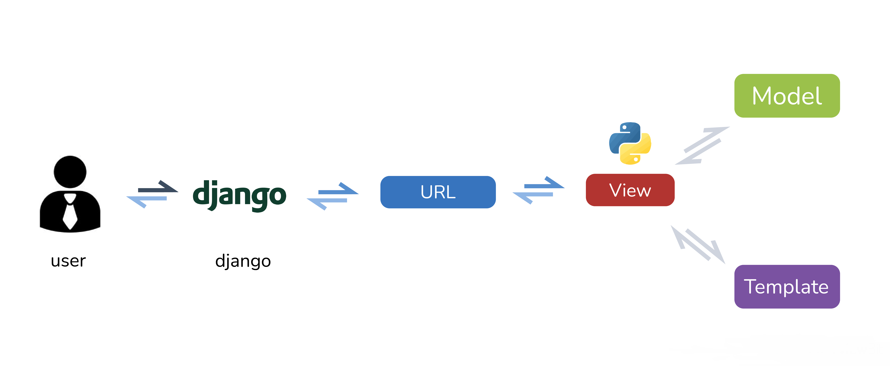

# Django Views

## Overview


İki tip views vardır;
## Function-based views vs Class-based views 

Django has two types of views; function-based views (FBVs), and class-based views (CBVs). Django originally started out with only FBVs, but then added CBVs as a way to templatize functionality so that you didn’t have to write boilerplate (i.e. the same code) code over and over again.

Class base views ler, pythonun kendi içerisindeki class ları inherit ediyoruz.Bir çok çözüm hazır olarak bulunmaktadır.
Ama biz konuyu anlamak için function base lerle başlayıp kendimiz yazacağız. def ile başlayıp bir function yazmamız demek.

## A simple view

Here’s a view that returns a simple HTML document:

Burada basit bir HTML dokümanı döndüren bir view var:
Aşağıda home_view çağırıldığında HttpResponse dönecek. HttpResponse içine de html diye tanımladığımız yazı döndürülecek. Bu çok pratik değil. Django default olarak reder ı import ederek views lara başlıyor.

```py
# First, we import the class HttpResponse from the django.http module.
from django.http import HttpResponse

# Next, we define a function called home_view. This is the view function. 
# Each view function takes an HttpRequest object as its first parameter, which is typically named "request".
def home_view(request):
    html = "<html><body>Hello World!</body></html>"
    return HttpResponse(html)
    # return HttpResponse("<html><body>Hello World!</body></html>")
    # The view returns an HttpResponse object that contains the generated response. 
    # Each view function is responsible for returning an HttpResponse object.
```
Another example with rendering an html page:

Bir diğer örnek; render ı import ettiğimizde bu modülle home_view çağırıldığında istediğimiz yerde belirlediğimiz bir html dokümanını render ediyor yani kullanıcıya gösteriyor. Yukarıdakinden tek farkı; orada doğrudan kendi içerisindeki code u HttpRespose olarak dönüyor, ama burada daha üst seviye, çok uzun bir sayfa olabilir, böyle fonksiyonun içine koymaktansa modüler yapı olarak gösterilecek sayfayı hazırlanmış biryerden çağırıp onu gösteriyoruz.Birinci eleman olarak request, üçüncü eleman olarak da context yapısını return ediyoruz. Context ile veriyi home.html template imizin içine atıyoruz, sergileceklerimizi kullanıcı nın görmesi için home.html de sergiliyoruz.
```py
# To render an html page, import render.
from django.shortcuts import render

def home_view(request):
    # There will be a context, we will use it on the html page.
    context = {
        'first_name': 'Rafe',
        'last_name': 'Stefano',
    }    
    return render(request, "app/home.html", context)
```

- More information about [Request and response objects](https://docs.djangoproject.com/en/3.2/ref/request-response/#module-django.http)

Note that the name of the view function doesn’t matter; it doesn’t have to be named in a certain way in order for Django to recognize it. Give a meaningfull name which makes sense, clearly indicates what it does.


# Django Templates

Being a web framework, Django needs a convenient way to generate HTML dynamically. The most common approach relies on templates. A template contains the static parts of the desired HTML output as well as some special syntax describing how dynamic content will be inserted.

Bir web framework olan Django, dinamik olarak HTML oluşturmak için uygun bir yola ihtiyaç duyar. En yaygın yaklaşım templates lere dayanır. Bir templates (şablon), istenen HTML çıktısının statik kısımlarını ve ayrıca dinamik içeriğin nasıl ekleneceğini açıklayan bazı özel sözdizimlerini içerir.

A Django project can be configured with one or several template engines (or even zero if you don’t use templates). Django ships built-in backends for its own template system, creatively called the Django template language (DTL).

Bir Django projesi, bir veya birkaç template motoruyla (veya template kullanmıyorsanız sıfır bile) yapılandırılabilir. Django, yaratıcı bir şekilde Django Template Languagedili (DTL) olarak adlandırılan kendi template sistemi için yerleşik arka uçları gönderir.

The Django template language is Django’s own template system.

Django template language, Django'nun kendi template sistemidir.


## The Django template language (DTL)

A Django template is a text document or a Python string marked-up using the Django template language. Some constructs are recognized and interpreted by the template engine.

Django template, Django template dili kullanılarak işaretlenmiş bir metin belgesi veya Python dizesidir. Bazı yapılar, template motoru tarafından tanınır ve yorumlanır.

The syntax of the Django template language involves four constructs.
Django template dilinin sözdizimi dört yapı içerir.

- Variables
- Tags
- Filters
- Comments

### Variables

A variable outputs a value from the context, which is a dict-like object mapping keys to values.

Bir değişken, değerlere anahtarları dikte benzeri bir nesne eşleme olan bağlamdan bir değer çıkarır.

Variables are surrounded by {{ and }} like this:

```py
My first name is {{ first_name }}. My last name is {{ last_name }}.
```

With a context of ```{'first_name': 'Rafe', 'last_name': 'Stefano'}```, this template renders to:

```py
My first name is Rafe. My last name is Stefano.
```

Dictionary lookup, attribute lookup and list-index lookups are implemented with a dot notation:

Dictionary araması, nitelik araması ve liste dizini aramaları bir nokta gösterimi ile uygulanır:

```py
{{ my_dict.key }}
{{ my_object.attribute }}
{{ my_list.0 }}
```


### Tags
[Tags reference](https://docs.djangoproject.com/en/3.2/ref/templates/builtins/#ref-templates-builtins-tags)

Tags provide arbitrary logic in the rendering process.
Tags, oluşturma sürecinde keyfi mantık sağlar.


This definition is deliberately vague. For example, a tag can output content, serve as a control structure e.g. an “if” statement or a “for” loop, grab content from a database, or even enable access to other template tags.

Bu tanım kasıtlı olarak belirsizdir. Örneğin, bir etiket içeriğin çıktısını alabilir, örneğin bir kontrol yapısı olarak hizmet edebilir. bir "if" ifadesi veya bir "for" döngüsü, bir veritabanından içerik alın ve hatta diğer template etiketlerine erişimi etkinleştirin.


Tags are surrounded by  like this:

Tags şöyle  ile çevrilidir:


```py

```
[csrf token reference](https://docs.djangoproject.com/en/3.2/ref/csrf/)

Most tags accept arguments:

```py

```

Some tags require beginning and ending tags:

```html

    Hello, {{ user.username }}.

```

A reference of built-in tags is available as well as instructions for writing custom tags.


### Filters
[Filters reference](https://docs.djangoproject.com/en/3.2/ref/templates/builtins/#ref-templates-builtins-filters)

Filters transform the values of variables and tag arguments.

Filtreler, değişkenlerin ve etiket argümanlarının değerlerini dönüştürür.


They look like this:
Şuna benziyorlar:


```py
{{ django|title }}
```

With a context of {'django': 'the web framework for perfectionists with deadlines'}, this template renders to:

```txt
The Web Framework For Perfectionists With Deadlines
```

Some filters take an argument:

```py
{{ my_date|date:"Y-m-d" }}
```

Note that you don't have to memorize this filters. Always look at the documentation, and create your hands-on notes to easy access your frequently used filters. For ```date``` here is the documentation:

[Django filter: date](https://docs.djangoproject.com/en/3.2/ref/templates/builtins/#date)

A reference of built-in filters is available as well as instructions for writing custom filters.


### Comments

Comments look like this:

```
{# this won't be rendered #}
```

A  
...
tag provides multi-line comments.
...

